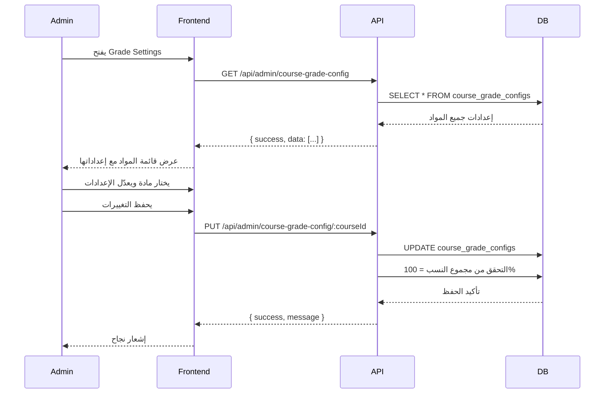
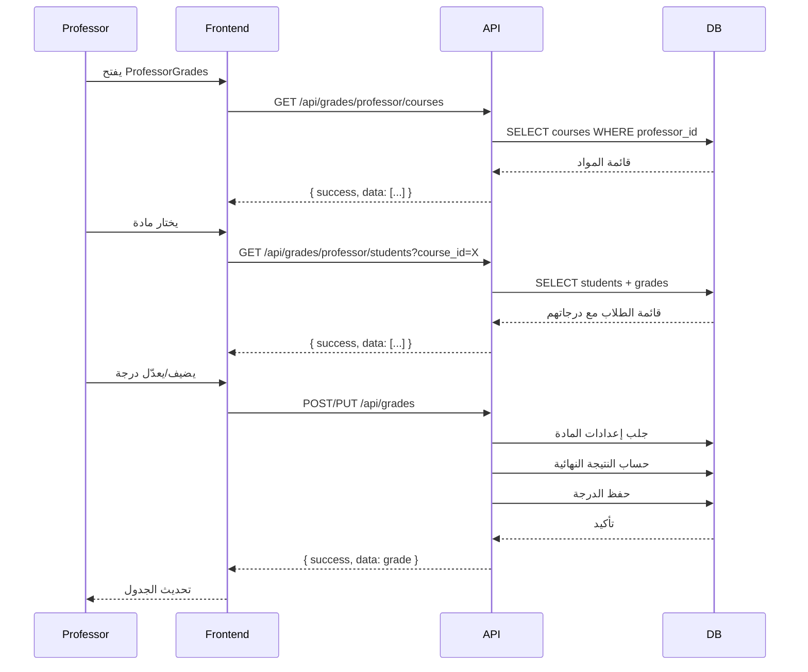
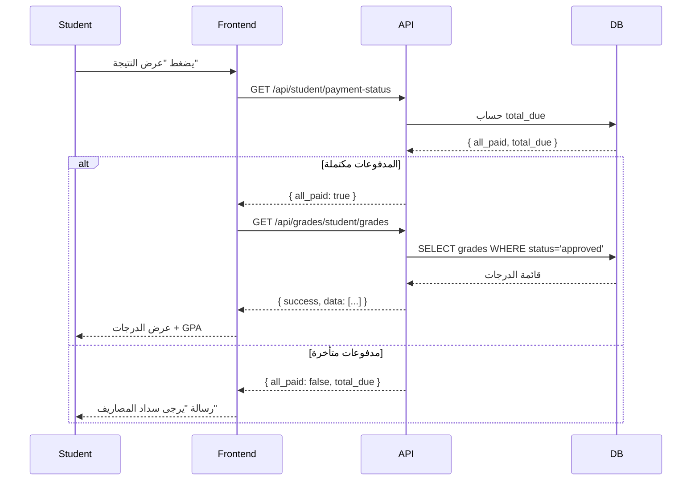

# وثيقة التصميم - نظام الدرجات والمدفوعات المحسّن

## Overview

هذه الوثيقة تصف التصميم التقني لنظام الدرجات والمدفوعات المحسّن في NCTU ERP. الهدف هو توفير مرونة أكبر في إدارة الدرجات من خلال إعدادات مخصصة لكل مادة، نظام CRUD كامل للأستاذ، وربط عرض النتائج بحالة المدفوعات.

### الأهداف الرئيسية

1. **إعدادات مرنة**: إعدادات درجات مخصصة لكل مادة بدلاً من الإعدادات العامة
2. **استقلالية الأستاذ**: نظام CRUD كامل للدرجات دون الحاجة للأدمن
3. **ربط المدفوعات**: عرض النتائج مشروط بسداد المصاريف الدراسية
4. **دقة الحسابات**: معادلات دقيقة لحساب الدرجات والـ GPA
5. **قابلية الاستيراد/التصدير**: parser وpretty printer لإعدادات الدرجات

### ملاحظة مهمة جداً

**الفرق بين التقديرات والدرجات:**

- **ass1 و ass2**: هما **تقديرات** (P/M/D) وليست درجات رقمية. الأستاذ يدخل التقدير فقط.
- **ass1_score و ass2_score**: هما **قيم محسوبة تلقائياً** من التقديرات حسب الـ config:
  - P → p_value (مثلاً 30)
  - M → m_value (مثلاً 21)
  - D → d_value (مثلاً 15)
- **final_exam_score**: هو **الدرجة الرقمية الوحيدة** التي يدخلها الأستاذ مباشرة (0-150)

**الدرجة النهائية = ass1_score + ass2_score + final_exam_score** (مجموع مباشر بدون نسب مئوية)

المعادلة الصحيحة:
```
// الأستاذ يدخل:
assignment1_grade = "P" أو "M" أو "D"
assignment2_grade = "P" أو "M" أو "D"
final_exam_score = 120 (درجة رقمية من 0-150)

// النظام يحسب تلقائياً:
assignment1_score = config.p_value (مثلاً 30)
assignment2_score = config.m_value (مثلاً 21)

// المجموع النهائي:
total_score = assignment1_score + assignment2_score + final_exam_score
            = 30 + 21 + 120 = 171

total_percentage = (total_score / (ass1_max + ass2_max + final_max)) * 100
                 = (171 / 210) * 100 = 81.43%
```

المشروع يعتمد على:
- **Backend**: Express.js + MySQL + Sequelize ORM
- **Frontend**: React 18 + Vite + CSS Modules
- **Auth**: JWT مع أدوار (admin, professor, accountant, student)

---

## Architecture

### نظرة عامة على البنية

```
Client (React 18 + Vite)
  │
  ├── AuthContext (JWT + axios interceptors)
  │
  ├── Pages
  │     ├── /admin/grade-settings     → GradeSettings (role: admin)
  │     ├── /grades                   → ProfessorGrades (role: professor)
  │     ├── /portal                   → StudentPortal (role: student)
  │     └── /accountant               → AccountantDashboard (role: accountant)
  │
  └── API Layer (axios)
        └── baseURL: /api

Server (Express.js)
  │
  ├── /api/admin/course-grade-config/*    → courseGradeConfigController (NEW)
  ├── /api/grades/*                       → gradeController (MODIFIED)
  ├── /api/student/*                      → gradeController (MODIFIED)
  └── /api/accountant/*                   → accountantController (EXISTING)
```

### تدفق البيانات - إعدادات الدرجات



### تدفق البيانات - إدارة الدرجات (الأستاذ)



### تدفق البيانات - عرض النتائج (الطالب)



---

## Components and Interfaces

### ملفات جديدة - Backend

| الملف | الوصف |
|-------|-------|
| `server/models/CourseGradeConfig.js` | نموذج إعدادات الدرجات لكل مادة |
| `server/controllers/courseGradeConfigController.js` | CRUD لإعدادات الدرجات |
| `server/routes/courseGradeConfigRoutes.js` | مسارات `/api/admin/course-grade-config/*` |
| `server/utils/gradeCalculator.js` | دوال حساب الدرجات والـ GPA |
| `server/utils/gradeConfigParser.js` | Parser وPretty Printer للإعدادات |

### ملفات معدّلة - Backend

| الملف | التعديل |
|-------|---------|
| `server/controllers/gradeController.js` | إضافة `getProfessorStudents`, `updateGrade`, `deleteGrade` |
| `server/routes/gradeRoutes.js` | إضافة مسارات CRUD للدرجات |
| `server/models/Grade.js` | تعديل `beforeSave` hook لاستخدام إعدادات المادة |
| `server/routes/adminRoutes.js` | تضمين courseGradeConfigRoutes |

### ملفات جديدة - Frontend

| الملف | الوصف |
|-------|-------|
| `client/frontend/src/pages/Admin/GradeSettingsPage.jsx` | صفحة إدارة إعدادات الدرجات (جديدة) |
| `client/frontend/src/pages/Admin/GradeSettingsPage.module.css` | تنسيق الصفحة |
| `client/frontend/src/components/GradeForm.jsx` | نموذج إضافة/تعديل الدرجات |
| `client/frontend/src/components/GradeForm.module.css` | تنسيق النموذج |

### ملفات معدّلة - Frontend

| الملف | التعديل |
|-------|---------|
| `client/frontend/src/pages/Admin/GradeSettings.jsx` | تحويل من إعدادات عامة إلى إعدادات لكل مادة |
| `client/frontend/src/pages/ProfessorGrades.jsx` | إضافة CRUD كامل للدرجات |
| `client/frontend/src/pages/StudentPortal.jsx` | إضافة التحقق من المدفوعات قبل عرض النتائج |
| `client/frontend/src/App.jsx` | إضافة مسار `/admin/grade-settings-page` |

---

## Data Models

### CourseGradeConfig (جديد)

```javascript
const CourseGradeConfig = sequelize.define('CourseGradeConfig', {
  id: {
    type: DataTypes.INTEGER,
    primaryKey: true,
    autoIncrement: true
  },
  course_id: {
    type: DataTypes.INTEGER,
    allowNull: false,
    unique: true,
    references: {
      model: 'courses',
      key: 'id'
    },
    comment: 'المادة المرتبطة بهذه الإعدادات'
  },
  
  // النسب المئوية (يجب أن يكون المجموع = 100%)
  ass1_percentage: {
    type: DataTypes.DECIMAL(5, 2),
    defaultValue: 15.00,
    comment: 'نسبة الواجب الأول من الدرجة النهائية (%)'
  },
  ass2_percentage: {
    type: DataTypes.DECIMAL(5, 2),
    defaultValue: 15.00,
    comment: 'نسبة الواجب الثاني من الدرجة النهائية (%)'
  },
  final_percentage: {
    type: DataTypes.DECIMAL(5, 2),
    defaultValue: 70.00,
    comment: 'نسبة الامتحان النهائي من الدرجة النهائية (%)'
  },
  
  // الدرجات القصوى
  ass1_max: {
    type: DataTypes.DECIMAL(5, 2),
    defaultValue: 30.00,
    comment: 'الدرجة القصوى للواجب الأول'
  },
  ass2_max: {
    type: DataTypes.DECIMAL(5, 2),
    defaultValue: 30.00,
    comment: 'الدرجة القصوى للواجب الثاني'
  },
  final_max: {
    type: DataTypes.DECIMAL(5, 2),
    defaultValue: 150.00,
    comment: 'الدرجة القصوى للامتحان النهائي'
  },
  
  // قيم P/M/D
  p_value: {
    type: DataTypes.DECIMAL(5, 2),
    defaultValue: 30.00,
    comment: 'قيمة Pass (P)'
  },
  m_value: {
    type: DataTypes.DECIMAL(5, 2),
    defaultValue: 21.00,
    comment: 'قيمة Merit (M)'
  },
  d_value: {
    type: DataTypes.DECIMAL(5, 2),
    defaultValue: 15.00,
    comment: 'قيمة Distinction (D)'
  },
  
  created_at: {
    type: DataTypes.DATE,
    defaultValue: DataTypes.NOW
  },
  updated_at: {
    type: DataTypes.DATE,
    defaultValue: DataTypes.NOW
  }
}, {
  tableName: 'course_grade_configs',
  timestamps: false,
  indexes: [
    { fields: ['course_id'], unique: true }
  ]
});

// Validation hook
CourseGradeConfig.beforeSave(async (config) => {
  const total = parseFloat(config.ass1_percentage) + 
                parseFloat(config.ass2_percentage) + 
                parseFloat(config.final_percentage);
  
  if (Math.abs(total - 100) > 0.01) {
    throw new Error('مجموع النسب المئوية يجب أن يساوي 100%');
  }
});
```

### Grade (تعديل)

التعديلات على نموذج `Grade` الموجود:

**ملاحظة مهمة:** 
- `assignment1_grade` و `assignment2_grade` هما **input من الأستاذ** (P/M/D)
- `assignment1_score` و `assignment2_score` هما **computed values** يتم حسابهما تلقائياً
- `final_exam_score` هو **input من الأستاذ** (درجة رقمية 0-150)

```javascript
// في beforeSave hook
Grade.beforeSave(async (grade) => {
  // جلب إعدادات المادة
  const config = await CourseGradeConfig.findOne({
    where: { course_id: grade.course_id }
  });
  
  // استخدام القيم الافتراضية إذا لم توجد إعدادات
  const ass1Max = config?.ass1_max || 30;
  const ass2Max = config?.ass2_max || 30;
  const finalMax = config?.final_max || 150;
  const pValue = config?.p_value || 30;
  const mValue = config?.m_value || 21;
  const dValue = config?.d_value || 15;
  
  // تحويل التقديرات (P/M/D) إلى درجات رقمية (computed values)
  const assignmentScores = {
    'D': dValue,
    'M': mValue,
    'P': pValue
  };
  
  // حساب assignment scores تلقائياً من التقديرات
  grade.assignment1_score = assignmentScores[grade.assignment1_grade] || 0;
  grade.assignment2_score = assignmentScores[grade.assignment2_grade] || 0;
  
  // حساب المجموع (مجموع مباشر بدون نسب)
  grade.total_score = grade.assignment1_score + 
                      grade.assignment2_score + 
                      (grade.final_exam_score || 0);
  
  // حساب النسبة المئوية
  const maxTotal = ass1Max + ass2Max + finalMax;
  grade.total_percentage = (grade.total_score / maxTotal) * 100;
  
  // تحديد النتيجة والـ GPA
  const percentage = grade.total_percentage;
  if (percentage >= 85) {
    grade.final_result = 'Distinction';
    grade.grade_point = 4.0;
    grade.letter_grade = 'A';
  } else if (percentage >= 70) {
    grade.final_result = 'Merit';
    grade.grade_point = 3.0;
    grade.letter_grade = 'B';
  } else if (percentage >= 50) {
    grade.final_result = 'Pass';
    grade.grade_point = 2.0;
    grade.letter_grade = 'C';
  } else if (percentage >= 30) {
    grade.final_result = 'Refer';
    grade.grade_point = 1.0;
    grade.letter_grade = 'D';
  } else {
    grade.final_result = 'Fail';
    grade.grade_point = 0.0;
    grade.letter_grade = 'F';
  }
});
```

### العلاقات (Associations)

```javascript
// في server/models/index.js أو ملف associations منفصل

// CourseGradeConfig ↔ Course
CourseGradeConfig.belongsTo(Course, { foreignKey: 'course_id' });
Course.hasOne(CourseGradeConfig, { foreignKey: 'course_id' });

// Grade ↔ CourseGradeConfig (غير مباشر عبر course_id)
// يتم جلب الإعدادات في beforeSave hook
```

---

## API Design

### Course Grade Config Endpoints (جديد)

#### 1. الحصول على جميع الإعدادات

```
GET /api/admin/course-grade-config
Auth: admin
Query: specialty_id?, academic_year_id?, semester_id?

Response: {
  success: true,
  data: [
    {
      id: 1,
      course_id: 5,
      course_code: "CS101",
      course_name: "Introduction to Programming",
      arabic_name: "مقدمة في البرمجة",
      specialty_name: "Computer Science",
      ass1_percentage: 15.00,
      ass2_percentage: 15.00,
      final_percentage: 70.00,
      ass1_max: 30.00,
      ass2_max: 30.00,
      final_max: 150.00,
      p_value: 30.00,
      m_value: 21.00,
      d_value: 15.00,
      created_at: "2024-01-15T10:00:00Z",
      updated_at: "2024-01-15T10:00:00Z"
    },
    ...
  ],
  count: 25
}
```

#### 2. الحصول على إعدادات مادة محددة

```
GET /api/admin/course-grade-config/:courseId
Auth: admin

Response: {
  success: true,
  data: {
    id: 1,
    course_id: 5,
    ass1_percentage: 15.00,
    ass2_percentage: 15.00,
    final_percentage: 70.00,
    ass1_max: 30.00,
    ass2_max: 30.00,
    final_max: 150.00,
    p_value: 30.00,
    m_value: 21.00,
    d_value: 15.00
  }
}

Error (404): {
  success: false,
  message: "لم يتم العثور على إعدادات لهذه المادة، سيتم استخدام القيم الافتراضية"
}
```

#### 3. إنشاء إعدادات جديدة

```
POST /api/admin/course-grade-config
Auth: admin
Body: {
  course_id: 5,
  ass1_percentage: 20.00,
  ass2_percentage: 20.00,
  final_percentage: 60.00,
  ass1_max: 30.00,
  ass2_max: 30.00,
  final_max: 150.00,
  p_value: 30.00,
  m_value: 21.00,
  d_value: 15.00
}

Validation:
- ass1_percentage + ass2_percentage + final_percentage = 100%
- جميع القيم > 0
- course_id موجود في جدول courses

Response: {
  success: true,
  message: "تم إنشاء الإعدادات بنجاح",
  data: { ...config }
}

Error (400): {
  success: false,
  message: "مجموع النسب المئوية يجب أن يساوي 100%"
}
```

#### 4. تحديث إعدادات موجودة

```
PUT /api/admin/course-grade-config/:courseId
Auth: admin
Body: {
  ass1_percentage: 25.00,
  ass2_percentage: 25.00,
  final_percentage: 50.00,
  // ... باقي الحقول
}

Response: {
  success: true,
  message: "تم تحديث الإعدادات بنجاح",
  data: { ...updatedConfig }
}
```

#### 5. حذف إعدادات (العودة للقيم الافتراضية)

```
DELETE /api/admin/course-grade-config/:courseId
Auth: admin

Response: {
  success: true,
  message: "تم حذف الإعدادات، سيتم استخدام القيم الافتراضية"
}
```

#### 6. استيراد إعدادات من JSON

```
POST /api/admin/course-grade-config/import
Auth: admin
Content-Type: application/json
Body: [
  {
    course_id: 5,
    ass1_percentage: 15.00,
    ass2_percentage: 15.00,
    final_percentage: 70.00,
    ...
  },
  ...
]

Response: {
  success: true,
  message: "تم استيراد 10 إعدادات بنجاح",
  data: {
    imported: 10,
    failed: 0,
    errors: []
  }
}
```

#### 7. تصدير جميع الإعدادات

```
GET /api/admin/course-grade-config/export
Auth: admin

Response: {
  success: true,
  data: [
    {
      course_id: 5,
      course_code: "CS101",
      ass1_percentage: 15.00,
      ...
    },
    ...
  ]
}

// يمكن حفظها كملف JSON
```

### Grade Endpoints (تعديل)

#### 8. الحصول على طلاب المادة مع درجاتهم

```
GET /api/grades/professor/students
Auth: professor
Query: course_id (required)

Response: {
  success: true,
  data: [
    {
      student_id: 10,
      student_code: "2024001",
      full_name: "أحمد محمد",
      specialty_name: "Computer Science",
      current_year: 2,
      grade: {
        id: 50,
        // التقديرات (input من الأستاذ)
        assignment1_grade: "P",  // تقدير Pass
        assignment2_grade: "M",  // تقدير Merit
        
        // الدرجات المحسوبة (computed values)
        assignment1_score: 30.00,  // محسوبة من P → p_value
        assignment2_score: 21.00,  // محسوبة من M → m_value
        
        // الدرجة الرقمية (input من الأستاذ)
        final_exam_score: 120.00,  // درجة رقمية مباشرة (0-150)
        
        // النتائج المحسوبة
        total_score: 171.00,       // = 30 + 21 + 120
        total_percentage: 81.43,   // = (171/210) * 100
        final_result: "Merit",
        letter_grade: "B",
        grade_point: 3.0,
        status: "draft"
      } || null
    },
    ...
  ],
  course_config: {
    ass1_max: 30.00,
    ass2_max: 30.00,
    final_max: 150.00,
    p_value: 30.00,  // قيمة Pass
    m_value: 21.00,  // قيمة Merit
    d_value: 15.00   // قيمة Distinction
  }
}

ملاحظة: 
- assignment1_score و assignment2_score هما قيم محسوبة تلقائياً من التقديرات
- الأستاذ يدخل فقط: assignment1_grade (P/M/D), assignment2_grade (P/M/D), final_exam_score (0-150)
```

#### 9. تحديث درجة موجودة

```
PUT /api/grades/:id
Auth: professor
Body: {
  // الأستاذ يدخل التقديرات (P/M/D) وليس الدرجات الرقمية
  assignment1_grade: "M",  // تقدير Merit
  assignment2_grade: "P",  // تقدير Pass
  
  // الدرجة الرقمية للامتحان النهائي
  final_exam_score: 135.00,  // درجة رقمية (0-150)
  
  notes: "تحسن ملحوظ"
}

ملاحظة مهمة:
- الأستاذ يدخل assignment grades كتقديرات (P/M/D) وليس scores
- النظام يحسب assignment1_score و assignment2_score تلقائياً من التقديرات
- final_exam_score هو الدرجة الرقمية الوحيدة التي يدخلها الأستاذ مباشرة

Validation:
- الأستاذ يملك هذه الدرجة (professor_submitted_by)
- status = 'draft' فقط
- assignment1_grade و assignment2_grade في ['P', 'M', 'D']
- final_exam_score بين 0 و final_max

Response: {
  success: true,
  message: "تم تحديث الدرجة بنجاح",
  data: {
    id: 50,
    assignment1_grade: "M",
    assignment1_score: 21.00,  // محسوبة تلقائياً من M → m_value
    assignment2_grade: "P",
    assignment2_score: 30.00,  // محسوبة تلقائياً من P → p_value
    final_exam_score: 135.00,
    total_score: 186.00,       // = 21 + 30 + 135
    total_percentage: 88.57,   // = (186/210) * 100
    final_result: "Distinction",
    letter_grade: "A",
    grade_point: 4.0
  }
}

Error (403): {
  success: false,
  message: "لا يمكن تعديل درجة معتمدة"
}
```

#### 10. حذف درجة

```
DELETE /api/grades/:id
Auth: professor

Validation:
- الأستاذ يملك هذه الدرجة
- status = 'draft' فقط

Response: {
  success: true,
  message: "تم حذف الدرجة بنجاح"
}

Error (400): {
  success: false,
  message: "لا يمكن حذف درجة معتمدة أو قيد المراجعة"
}
```

### Student Endpoints (تعديل)

#### 11. التحقق من حالة المدفوعات

```
GET /api/student/payment-status
Auth: student

Response: {
  success: true,
  data: {
    all_paid: true,
    total_due: 0.00,
    total_invoiced: 5000.00,
    total_paid: 5000.00,
    pending_invoices: 0,
    overdue_invoices: 0
  }
}
```

#### 12. الحصول على الدرجات (مشروط بالمدفوعات)

```
GET /api/grades/student/grades
Auth: student

Logic:
1. التحقق من حالة المدفوعات
2. إذا all_paid = false → رفض الطلب
3. إذا all_paid = true → إرجاع الدرجات المعتمدة

Response (success): {
  success: true,
  data: [
    {
      id: 50,
      course_code: "CS101",
      course_name: "Introduction to Programming",
      arabic_name: "مقدمة في البرمجة",
      credit_hours: 3,
      assignment1_grade: "P",
      assignment2_grade: "M",
      final_exam_score: 120.00,
      total_score: 171.00,
      total_percentage: 81.43,
      final_result: "Merit",
      letter_grade: "B",
      grade_point: 3.0,
      academic_year: "2023-2024",
      semester: "الفصل الأول"
    },
    ...
  ],
  gpa: 3.25
}

Response (payment required): {
  success: false,
  message: "يرجى سداد المصاريف الدراسية لعرض النتائج",
  data: {
    total_due: 2500.00,
    overdue_invoices: 2
  }
}
```

---

## Correctness Properties

*A property is a characteristic or behavior that should hold true across all valid executions of a system — essentially, a formal statement about what the system should do. Properties serve as the bridge between human-readable specifications and machine-verifiable correctness guarantees.*

قبل كتابة الخصائص، سأقوم بتحليل معايير القبول لتحديد ما يمكن اختباره:

