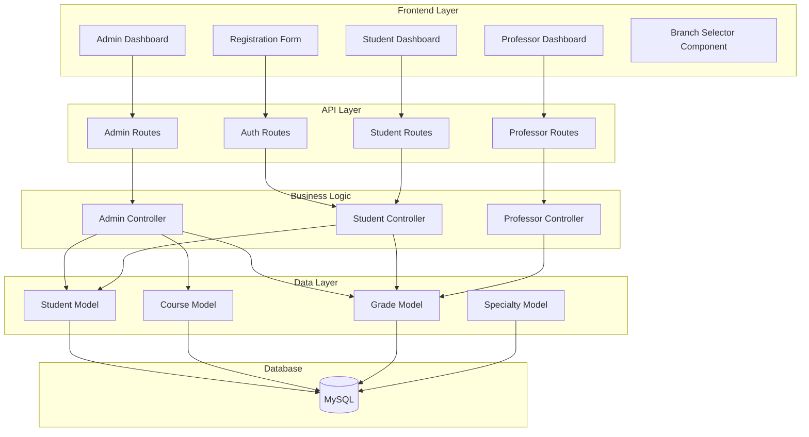
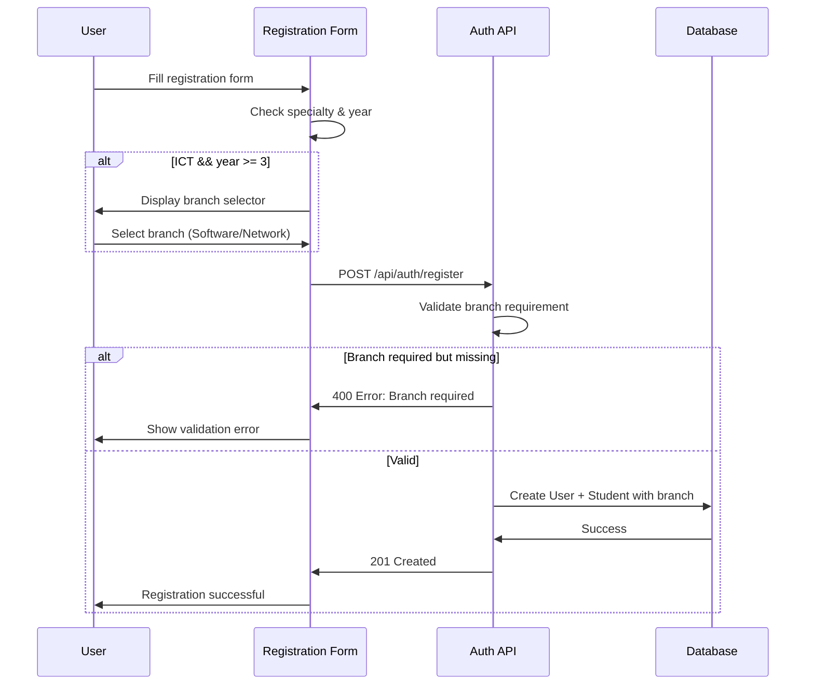
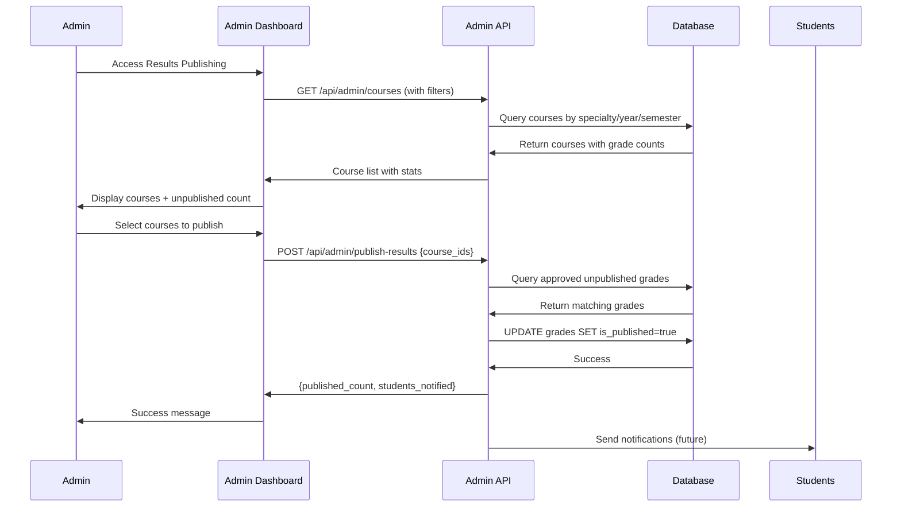
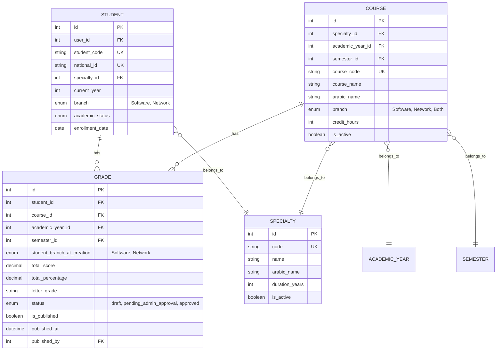

# Design Document: ICT Branch Support and Results Publishing System

## Overview

This design document specifies the technical implementation for adding ICT branch selection (Software/Network) for 3rd and 4th year students and fixing the results publishing system in the NCTU Educational ERP. The system will enable branch differentiation during registration, filter courses by branch, and establish a working course-based results publishing workflow.

### Key Features

1. **Branch Selection System**: ICT students in years 3-4 select Software or Network branch during registration
2. **Branch-Filtered Course Display**: Courses are filtered by student branch for enrollment and grade viewing
3. **Course-Based Results Publishing**: Administrators publish approved grades by selecting specific courses
4. **Branch-Aware Admin Dashboard**: Results grouped and filtered by branch for ICT specialty
5. **Data Migration Support**: Existing students prompted to select branch on first login

### Technical Stack

- **Backend**: Node.js + Express + Sequelize ORM (MySQL)
- **Frontend**: React + Axios + CSS Modules
- **Database**: MySQL 8.0+
- **Authentication**: JWT-based with role-based access control

---

## Architecture

### System Components



### Data Flow: Branch Selection During Registration



### Data Flow: Results Publishing by Course



---

## Components and Interfaces

### Frontend Components

#### 1. BranchSelector Component

**Location**: `client/frontend/src/components/BranchSelector/BranchSelector.jsx`

**Purpose**: Reusable component for branch selection across registration, admin, and profile interfaces

**Props**:
```typescript
interface BranchSelectorProps {
  value: 'Software' | 'Network' | null;
  onChange: (branch: 'Software' | 'Network') => void;
  required?: boolean;
  disabled?: boolean;
  error?: string;
}
```

**Implementation**:
```jsx
import React from 'react';
import styles from './BranchSelector.module.css';

const BranchSelector = ({ value, onChange, required = false, disabled = false, error }) => {
  return (
    <div className={styles.branchSelector}>
      <label className={styles.label}>
        الفرع / Branch {required && <span className={styles.required}>*</span>}
      </label>
      <div className={styles.options}>
        <button
          type="button"
          className={`${styles.option} ${value === 'Software' ? styles.selected : ''}`}
          onClick={() => onChange('Software')}
          disabled={disabled}
        >
          <span className={styles.arabic}>البرمجيات</span>
          <span className={styles.english}>Software</span>
        </button>
        <button
          type="button"
          className={`${styles.option} ${value === 'Network' ? styles.selected : ''}`}
          onClick={() => onChange('Network')}
          disabled={disabled}
        >
          <span className={styles.arabic}>الشبكات</span>
          <span className={styles.english}>Network</span>
        </button>
      </div>
      {error && <span className={styles.error}>{error}</span>}
    </div>
  );
};

export default BranchSelector;
```

#### 2. BranchSelectionModal Component

**Location**: `client/frontend/src/components/BranchSelectionModal/BranchSelectionModal.jsx`

**Purpose**: Modal for existing students to select branch on first login

**Props**:
```typescript
interface BranchSelectionModalProps {
  isOpen: boolean;
  onSubmit: (branch: 'Software' | 'Network') => Promise<void>;
  studentInfo: {
    name: string;
    studentCode: string;
    currentYear: number;
  };
}
```

#### 3. ResultsPublishingInterface Component

**Location**: `client/frontend/src/pages/Admin/ResultsPublishing.jsx`

**Purpose**: Admin interface for publishing grades by course

**State**:
```typescript
interface ResultsPublishingState {
  filters: {
    specialty_id: number | null;
    academic_year_id: number | null;
    semester_id: number | null;
  };
  courses: Course[];
  selectedCourses: number[];
  stats: {
    total: number;
    published: number;
    unpublished: number;
  };
  loading: boolean;
}
```

**Key Methods**:
- `fetchCourses()`: Load courses with grade statistics
- `handleCourseSelection(courseId)`: Toggle course selection
- `handlePublish()`: Publish grades for selected courses
- `refreshStats()`: Reload statistics after publishing

#### 4. CourseManagement Component Enhancement

**Location**: `client/frontend/src/pages/Admin/CourseManagement.jsx`

**Enhancement**: Add branch field to course creation/editing form

**New Fields**:
```jsx
<FormControl>
  <FormLabel>Branch / الفرع</FormLabel>
  <Select
    value={formData.branch || ''}
    onChange={(e) => setFormData({...formData, branch: e.target.value})}
  >
    <option value="">Both / كلاهما</option>
    <option value="Software">Software / البرمجيات</option>
    <option value="Network">Network / الشبكات</option>
  </Select>
</FormControl>
```

### Backend API Endpoints

#### 1. Registration Endpoint Enhancement

**Endpoint**: `POST /api/auth/register`

**Request Body**:
```json
{
  "full_name": "string",
  "email": "string",
  "phone": "string",
  "national_id": "string",
  "specialty_id": number,
  "current_year": number,
  "branch": "Software" | "Network" | null,
  "birth_date": "YYYY-MM-DD",
  "gender": "male" | "female",
  "address": "string",
  "guardian_name": "string",
  "guardian_phone": "string",
  "guardian_relation": "string"
}
```

**Validation Logic**:
```javascript
// Check if branch is required
const specialty = await Specialty.findByPk(specialty_id);
const isICT = specialty.code === 'ICT' || specialty.name.includes('Information');
const requiresBranch = isICT && current_year >= 3;

if (requiresBranch && !branch) {
  return res.status(400).json({
    success: false,
    message: 'Branch selection is required for ICT 3rd and 4th year students',
    message_ar: 'اختيار الفرع مطلوب لطلاب تكنولوجيا المعلومات في السنة الثالثة والرابعة'
  });
}

if (requiresBranch && !['Software', 'Network'].includes(branch)) {
  return res.status(400).json({
    success: false,
    message: 'Invalid branch value. Must be Software or Network'
  });
}
```

#### 2. Update Student Branch Endpoint

**Endpoint**: `PUT /api/student/branch`

**Purpose**: Allow existing students to set their branch

**Request Body**:
```json
{
  "branch": "Software" | "Network"
}
```

**Response**:
```json
{
  "success": true,
  "message": "Branch updated successfully",
  "data": {
    "student_id": number,
    "branch": "Software" | "Network"
  }
}
```

**Implementation**:
```javascript
const updateStudentBranch = async (req, res) => {
  try {
    const { branch } = req.body;
    const studentId = req.user.studentId;

    // Validate branch value
    if (!['Software', 'Network'].includes(branch)) {
      return res.status(400).json({
        success: false,
        message: 'Invalid branch value'
      });
    }

    // Get student
    const student = await Student.findByPk(studentId, {
      include: [{ model: Specialty }]
    });

    if (!student) {
      return res.status(404).json({
        success: false,
        message: 'Student not found'
      });
    }

    // Check if student is ICT and year 3 or 4
    const isICT = student.Specialty.code === 'ICT';
    const requiresBranch = isICT && student.current_year >= 3;

    if (!requiresBranch) {
      return res.status(400).json({
        success: false,
        message: 'Branch selection not applicable for this student'
      });
    }

    // Update branch
    await student.update({ branch });

    res.json({
      success: true,
      message: 'Branch updated successfully',
      data: {
        student_id: student.id,
        branch: student.branch
      }
    });

  } catch (error) {
    console.error('Update student branch error:', error);
    res.status(500).json({
      success: false,
      message: 'Server error'
    });
  }
};
```

#### 3. Get Available Courses Endpoint Enhancement

**Endpoint**: `GET /api/student/courses`

**Query Parameters**:
- `academic_year_id`: number
- `semester_id`: number

**Response Enhancement**:
```json
{
  "success": true,
  "data": [
    {
      "id": number,
      "course_code": "string",
      "course_name": "string",
      "arabic_name": "string",
      "credit_hours": number,
      "branch": "Software" | "Network" | "Both" | null,
      "is_branch_specific": boolean
    }
  ]
}
```

**Implementation Logic**:
```javascript
const getAvailableCourses = async (req, res) => {
  try {
    const { academic_year_id, semester_id } = req.query;
    const studentId = req.user.studentId;

    // Get student with specialty
    const student = await Student.findByPk(studentId, {
      include: [{ model: Specialty }]
    });

    // Build where clause
    const where = {
      specialty_id: student.specialty_id,
      is_active: true
    };

    if (academic_year_id) where.academic_year_id = academic_year_id;
    if (semester_id) where.semester_id = semester_id;

    // Get all courses
    let courses = await Course.findAll({ where });

    // Filter by branch if student has one
    if (student.branch) {
      courses = courses.filter(course => {
        // Include courses with no branch, "Both", or matching branch
        return !course.branch || 
               course.branch === 'Both' || 
               course.branch === student.branch;
      });
    }

    // Add is_branch_specific flag
    const coursesWithFlag = courses.map(course => ({
      ...course.toJSON(),
      is_branch_specific: course.branch && course.branch !== 'Both'
    }));

    res.json({
      success: true,
      data: coursesWithFlag
    });

  } catch (error) {
    console.error('Get available courses error:', error);
    res.status(500).json({
      success: false,
      message: 'Server error'
    });
  }
};
```

#### 4. Publish Results Endpoint Fix

**Endpoint**: `POST /api/admin/publish-results`

**Current Issue**: Endpoint expects `semester_id`, `academic_year_id`, `specialty_id` but frontend needs course-based publishing

**New Request Body**:
```json
{
  "course_ids": [number],
  "filters": {
    "specialty_id": number | null,
    "academic_year_id": number | null,
    "semester_id": number | null
  }
}
```

**Response**:
```json
{
  "success": true,
  "message": "تم نشر 45 درجة بنجاح",
  "data": {
    "published_count": number,
    "students_notified": number,
    "published_at": "ISO8601 timestamp",
    "courses": [
      {
        "course_id": number,
        "course_name": "string",
        "grades_published": number
      }
    ]
  }
}
```

**Implementation**:
```javascript
const publishResults = async (req, res) => {
  const transaction = await sequelize.transaction();
  
  try {
    const { course_ids, filters } = req.body;

    // Validate input
    if (!course_ids || !Array.isArray(course_ids) || course_ids.length === 0) {
      if (!filters || (!filters.specialty_id && !filters.academic_year_id && !filters.semester_id)) {
        return res.status(400).json({
          success: false,
          message: 'يرجى تحديد المواد أو معايير التصفية',
          message_en: 'Please specify courses or filter criteria'
        });
      }
    }

    const Grade = require('../models/Grade');
    const Course = require('../models/Course');
    const Student = require('../models/Student');

    // Build where clause
    const where = {
      status: 'approved',
      is_published: false
    };

    // Use course_ids if provided
    if (course_ids && course_ids.length > 0) {
      where.course_id = { [Op.in]: course_ids };
    } else {
      // Use filters
      if (filters.semester_id) where.semester_id = filters.semester_id;
      if (filters.academic_year_id) where.academic_year_id = filters.academic_year_id;

      // Filter by specialty through students
      if (filters.specialty_id) {
        const students = await Student.findAll({
          where: { specialty_id: filters.specialty_id },
          attributes: ['id']
        });
        const studentIds = students.map(s => s.id);
        
        if (studentIds.length === 0) {
          await transaction.rollback();
          return res.status(404).json({
            success: false,
            message: 'لا يوجد طلاب في هذا التخصص'
          });
        }
        
        where.student_id = { [Op.in]: studentIds };
      }
    }

    // Get grades to publish
    const gradesToPublish = await Grade.findAll({
      where,
      include: [
        { model: Course, attributes: ['id', 'course_name', 'arabic_name'] },
        { model: Student, attributes: ['id', 'student_code'] }
      ],
      transaction
    });

    if (gradesToPublish.length === 0) {
      await transaction.rollback();
      return res.status(404).json({
        success: false,
        message: 'لا توجد درجات معتمدة للنشر',
        message_en: 'No approved grades available for publishing'
      });
    }

    // Update grades to published
    const publishedAt = new Date();
    await Grade.update(
      {
        is_published: true,
        published_at: publishedAt,
        published_by: req.user.id
      },
      { where, transaction }
    );

    // Get unique student IDs
    const uniqueStudentIds = [...new Set(gradesToPublish.map(g => g.student_id))];

    // Group by course for response
    const courseStats = {};
    gradesToPublish.forEach(grade => {
      const courseId = grade.course_id;
      if (!courseStats[courseId]) {
        courseStats[courseId] = {
          course_id: courseId,
          course_name: grade.Course?.course_name || 'Unknown',
          grades_published: 0
        };
      }
      courseStats[courseId].grades_published++;
    });

    await transaction.commit();

    // Log activity
    await logActivity(req.user.id, 'publish', 'Grades', null, {
      course_ids,
      filters,
      count: gradesToPublish.length,
      student_count: uniqueStudentIds.length
    });

    res.json({
      success: true,
      message: `تم نشر ${gradesToPublish.length} درجة بنجاح`,
      data: {
        published_count: gradesToPublish.length,
        students_notified: uniqueStudentIds.length,
        published_at: publishedAt,
        courses: Object.values(courseStats)
      }
    });

  } catch (error) {
    await transaction.rollback();
    console.error('Publish results error:', error);
    res.status(500).json({
      success: false,
      message: 'حدث خطأ أثناء نشر النتائج',
      error: process.env.NODE_ENV === 'development' ? error.message : undefined
    });
  }
};
```

#### 5. Get Courses with Grade Stats Endpoint

**Endpoint**: `GET /api/admin/courses/with-stats`

**Purpose**: Get courses with unpublished grade counts for results publishing interface

**Query Parameters**:
- `specialty_id`: number (optional)
- `academic_year_id`: number (optional)
- `semester_id`: number (optional)

**Response**:
```json
{
  "success": true,
  "data": [
    {
      "id": number,
      "course_code": "string",
      "course_name": "string",
      "arabic_name": "string",
      "branch": "Software" | "Network" | "Both" | null,
      "specialty": {
        "id": number,
        "name": "string",
        "arabic_name": "string"
      },
      "academic_year": {
        "id": number,
        "year_number": number
      },
      "semester": {
        "id": number,
        "semester_name": "string"
      },
      "grade_stats": {
        "total": number,
        "approved": number,
        "published": number,
        "unpublished_approved": number
      }
    }
  ]
}
```

**Implementation**:
```javascript
const getCoursesWithStats = async (req, res) => {
  try {
    const { specialty_id, academic_year_id, semester_id } = req.query;

    const where = { is_active: true };
    if (specialty_id) where.specialty_id = specialty_id;
    if (academic_year_id) where.academic_year_id = academic_year_id;
    if (semester_id) where.semester_id = semester_id;

    const courses = await Course.findAll({
      where,
      include: [
        { model: Specialty, attributes: ['id', 'name', 'arabic_name', 'code'] },
        { model: AcademicYear, attributes: ['id', 'year_number'] },
        { model: Semester, attributes: ['id', 'semester_name'] }
      ],
      order: [
        ['specialty_id', 'ASC'],
        ['academic_year_id', 'ASC'],
        ['semester_id', 'ASC'],
        ['course_code', 'ASC']
      ]
    });

    // Get grade stats for each course
    const coursesWithStats = await Promise.all(
      courses.map(async (course) => {
        const courseData = course.toJSON();

        // Get grade counts
        const [total, approved, published, unpublishedApproved] = await Promise.all([
          Grade.count({ where: { course_id: course.id } }),
          Grade.count({ where: { course_id: course.id, status: 'approved' } }),
          Grade.count({ where: { course_id: course.id, is_published: true } }),
          Grade.count({ where: { course_id: course.id, status: 'approved', is_published: false } })
        ]);

        return {
          ...courseData,
          grade_stats: {
            total,
            approved,
            published,
            unpublished_approved: unpublishedApproved
          }
        };
      })
    );

    res.json({
      success: true,
      data: coursesWithStats
    });

  } catch (error) {
    console.error('Get courses with stats error:', error);
    res.status(500).json({
      success: false,
      message: 'Server error'
    });
  }
};
```

---

## Data Models

### Database Schema Changes

#### 1. Student Model Enhancement

**Migration**: `migrations/YYYYMMDDHHMMSS-add-branch-to-students.js`

```javascript
module.exports = {
  up: async (queryInterface, Sequelize) => {
    await queryInterface.addColumn('students', 'branch', {
      type: Sequelize.ENUM('Software', 'Network'),
      allowNull: true,
      comment: 'فرع الطالب (للسنة الثالثة والرابعة في ICT)',
      after: 'current_year'
    });

    // Add index for performance
    await queryInterface.addIndex('students', ['branch'], {
      name: 'idx_students_branch'
    });

    // Add composite index for common queries
    await queryInterface.addIndex('students', ['specialty_id', 'current_year', 'branch'], {
      name: 'idx_students_specialty_year_branch'
    });
  },

  down: async (queryInterface, Sequelize) => {
    await queryInterface.removeIndex('students', 'idx_students_specialty_year_branch');
    await queryInterface.removeIndex('students', 'idx_students_branch');
    await queryInterface.removeColumn('students', 'branch');
  }
};
```

**Updated Model**: `server/models/Student.js`

```javascript
// Add to Student model definition
branch: {
  type: DataTypes.ENUM('Software', 'Network'),
  allowNull: true,
  comment: 'فرع الطالب (للسنة الثالثة والرابعة في ICT)'
},

// Add to indexes array
indexes: [
  // ... existing indexes
  { fields: ['branch'] },
  { fields: ['specialty_id', 'current_year', 'branch'] }
]
```

#### 2. Course Model Enhancement

**Migration**: `migrations/YYYYMMDDHHMMSS-add-branch-to-courses.js`

```javascript
module.exports = {
  up: async (queryInterface, Sequelize) => {
    await queryInterface.addColumn('courses', 'branch', {
      type: Sequelize.ENUM('Software', 'Network', 'Both'),
      allowNull: true,
      comment: 'فرع المادة (للمواد الخاصة بفرع معين)',
      after: 'semester_id'
    });

    // Add index for filtering
    await queryInterface.addIndex('courses', ['branch'], {
      name: 'idx_courses_branch'
    });

    // Add composite index for common queries
    await queryInterface.addIndex('courses', ['specialty_id', 'academic_year_id', 'branch'], {
      name: 'idx_courses_specialty_year_branch'
    });
  },

  down: async (queryInterface, Sequelize) => {
    await queryInterface.removeIndex('courses', 'idx_courses_specialty_year_branch');
    await queryInterface.removeIndex('courses', 'idx_courses_branch');
    await queryInterface.removeColumn('courses', 'branch');
  }
};
```

**Updated Model**: `server/models/Course.js`

```javascript
// Add to Course model definition
branch: {
  type: DataTypes.ENUM('Software', 'Network', 'Both'),
  allowNull: true,
  comment: 'فرع المادة (للمواد الخاصة بفرع معين)'
},

// Add to indexes array
indexes: [
  // ... existing indexes
  { fields: ['branch'] },
  { fields: ['specialty_id', 'academic_year_id', 'branch'] }
]
```

#### 3. Grade Model Enhancement (Historical Branch Tracking)

**Migration**: `migrations/YYYYMMDDHHMMSS-add-student-branch-to-grades.js`

```javascript
module.exports = {
  up: async (queryInterface, Sequelize) => {
    await queryInterface.addColumn('grades', 'student_branch_at_creation', {
      type: Sequelize.ENUM('Software', 'Network'),
      allowNull: true,
      comment: 'فرع الطالب وقت إنشاء الدرجة (للحفظ التاريخي)',
      after: 'student_id'
    });

    // Add index
    await queryInterface.addIndex('grades', ['student_branch_at_creation'], {
      name: 'idx_grades_student_branch'
    });
  },

  down: async (queryInterface, Sequelize) => {
    await queryInterface.removeIndex('grades', 'idx_grades_student_branch');
    await queryInterface.removeColumn('grades', 'student_branch_at_creation');
  }
};
```

**Updated Model**: `server/models/Grade.js`

```javascript
// Add to Grade model definition
student_branch_at_creation: {
  type: DataTypes.ENUM('Software', 'Network'),
  allowNull: true,
  comment: 'فرع الطالب وقت إنشاء الدرجة (للحفظ التاريخي)'
},

// Add to indexes array
indexes: [
  // ... existing indexes
  { fields: ['student_branch_at_creation'] }
]

// Update beforeSave hook to capture branch
Grade.beforeSave(async (grade) => {
  // ... existing calculation logic

  // Capture student branch at creation time
  if (grade.isNewRecord && grade.student_id) {
    const Student = require('./Student');
    const student = await Student.findByPk(grade.student_id);
    if (student && student.branch) {
      grade.student_branch_at_creation = student.branch;
    }
  }
});
```

### Entity Relationship Diagram



---

## Correctness Properties

*A property is a characteristic or behavior that should hold true across all valid executions of a system—essentially, a formal statement about what the system should do. Properties serve as the bridge between human-readable specifications and machine-verifiable correctness guarantees.*

Before writing the correctness properties, I need to analyze the acceptance criteria from the requirements document to determine which are testable as properties.


## Property Reflection

After analyzing all acceptance criteria, I identified the following redundancies:

**Redundant Properties to Remove:**
- 1.3, 1.4: Covered by Property 1 (branch field visibility rule)
- 2.2: Covered by Property 2 (branch validation)
- 3.3, 3.5, 4.1, 4.2, 4.5, 8.3: Covered by Property 4 (course visibility filtering)
- 7.3: Covered by Property 4 (same filtering logic)
- 8.5: Covered by Property 8 (student grade visibility)
- 10.4, 10.5: Covered by Property 10 (branch consistency validation)
- 11.3: Covered by Property 6 (no approved grades error)
- 11.4: Covered by example tests (response format)
- 15.1, 15.2: Covered by Property 10 (branch validation)
- 15.3: Covered by Property 13 (empty request validation)

**Properties to Combine:**
- 3.2 and 3.4: Combined into comprehensive course visibility property
- 5.3 and 5.4: Combined into publish operation property
- 11.1 and 11.2: Combined into publish validation property

**Final Unique Properties:**
1. Branch field visibility based on specialty and year
2. Branch validation for ICT year 3-4 students
3. Branch value constraints (Software/Network/NULL for students, Software/Network/Both/NULL for courses)
4. Course visibility filtering by branch
5. Grade count accuracy for publishing interface
6. Publish operation updates all approved grades atomically
7. Student grade visibility (only own published grades)
8. Branch consistency validation for grade operations
9. Historical branch preservation in grades
10. Publish validation (only approved grades)
11. Audit logging for publish operations
12. Error logging for branch-related errors

### Property 1: Branch Field Visibility Rule

*For any* student registration with specialty and year data, the branch selection field SHALL be visible if and only if the specialty is ICT AND current_year is 3 or 4.

**Validates: Requirements 1.1, 1.3, 1.4**

### Property 2: Branch Validation for ICT Students

*For any* ICT student registration where current_year ≥ 3, the registration SHALL fail if branch is NULL or empty, AND SHALL succeed if branch ∈ {"Software", "Network"}.

**Validates: Requirements 1.2, 2.2, 9.3**

### Property 3: Branch Value Constraints

*For any* Student model instance, the branch field SHALL accept only {"Software", "Network", NULL}, AND *for any* Course model instance, the branch field SHALL accept only {"Software", "Network", "Both", NULL}.

**Validates: Requirements 2.1, 3.1**

### Property 4: Course Visibility Filtering by Branch

*For any* ICT student S with branch B and *for any* course C:
- IF C.branch = B, THEN C is visible to S
- IF C.branch ∈ {NULL, "Both"}, THEN C is visible to S
- IF C.branch ≠ B AND C.branch ∉ {NULL, "Both"}, THEN C is NOT visible to S
- IF S.branch = NULL, THEN all courses for S.specialty are visible to S

**Validates: Requirements 3.2, 3.3, 3.4, 3.5, 4.1, 4.2, 4.3, 4.5, 7.3, 8.3**

### Property 5: Grade Count Accuracy

*For any* set of courses C and filter criteria F, the count of approved unpublished grades displayed SHALL equal the database count of grades where course_id ∈ C AND status = "approved" AND is_published = false AND (filters match F).

**Validates: Requirements 5.2, 7.4**

### Property 6: Publish Operation Atomicity

*For any* publish operation with course_ids C, either ALL approved unpublished grades for courses in C SHALL be updated to is_published = true with published_at timestamp and published_by admin_id, OR NONE SHALL be updated (transaction rollback).

**Validates: Requirements 5.3, 5.4, 6.2**

### Property 7: No Approved Grades Error

*For any* publish request where the set of matching approved unpublished grades is empty, the system SHALL return an error response with message "لا توجد درجات معتمدة للنشر".

**Validates: Requirements 5.5, 11.3**

### Property 8: Student Grade Visibility Boundary

*For any* student S, the set of grades returned by the student grades endpoint SHALL contain ONLY grades where student_id = S.id AND is_published = true.

**Validates: Requirements 8.1, 8.5**

### Property 9: Branch Consistency Validation

*For any* grade creation or enrollment operation involving student S and course C where C.branch ∉ {NULL, "Both"}, the operation SHALL fail if S.branch ≠ C.branch, AND SHALL succeed if S.branch = C.branch.

**Validates: Requirements 10.1, 10.4, 15.1, 15.2**

### Property 10: Historical Branch Preservation

*For any* grade G created at time T with student S having branch B, IF S.branch changes to B' at time T' > T, THEN G.student_branch_at_creation SHALL remain B (historical value preserved).

**Validates: Requirements 10.2, 10.3**

### Property 11: Publish Validation

*For any* publish operation, all grades in the operation SHALL have status = "approved", AND any grade with status ≠ "approved" SHALL be excluded from publishing with a warning logged.

**Validates: Requirements 11.1, 11.2**

### Property 12: Audit Logging for Publish Operations

*For any* successful publish operation P, the system SHALL create an audit log entry containing admin_id, timestamp, course_ids, and count of published grades.

**Validates: Requirements 11.5**

### Property 13: Empty Request Validation

*For any* publish-results request where course_ids is empty AND all filter fields (specialty_id, academic_year_id, semester_id) are NULL, the endpoint SHALL return a 400 error with message "يرجى تحديد المواد أو معايير التصفية".

**Validates: Requirements 6.4, 15.3**

### Property 14: Branch Error Logging

*For any* branch-related validation error E (enrollment mismatch, grade creation mismatch, invalid branch value), the system SHALL log error details including user_id, attempted operation, and validation failure reason.

**Validates: Requirements 15.5**

---

## Error Handling

### Validation Errors

**Branch Selection Validation**:
```javascript
// Error response format
{
  "success": false,
  "message": "Branch selection is required for ICT 3rd and 4th year students",
  "message_ar": "اختيار الفرع مطلوب لطلاب تكنولوجيا المعلومات في السنة الثالثة والرابعة",
  "field": "branch",
  "code": "BRANCH_REQUIRED"
}
```

**Branch Mismatch Errors**:
```javascript
// Enrollment mismatch
{
  "success": false,
  "message": "This course is only available for Software branch students",
  "message_ar": "هذه المادة متاحة فقط لطلاب فرع البرمجيات",
  "code": "BRANCH_MISMATCH",
  "required_branch": "Software",
  "student_branch": "Network"
}

// Grade creation mismatch
{
  "success": false,
  "message": "Student is not enrolled in this course's branch",
  "message_ar": "الطالب غير مسجل في فرع هذه المادة",
  "code": "BRANCH_MISMATCH",
  "student_id": 123,
  "course_id": 456
}
```

**Publishing Errors**:
```javascript
// No courses or filters provided
{
  "success": false,
  "message": "Please specify courses or filter criteria",
  "message_ar": "يرجى تحديد المواد أو معايير التصفية",
  "code": "MISSING_PARAMETERS"
}

// No approved grades found
{
  "success": false,
  "message": "No approved grades available for publishing",
  "message_ar": "لا توجد درجات معتمدة للنشر",
  "code": "NO_APPROVED_GRADES",
  "course_ids": [1, 2, 3]
}
```

### Error Logging Strategy

**Log Levels**:
- `ERROR`: Branch validation failures, publish operation failures, database errors
- `WARN`: Excluded grades during publish, branch mismatch attempts
- `INFO`: Successful publish operations, branch updates

**Log Format**:
```javascript
{
  "timestamp": "ISO8601",
  "level": "ERROR" | "WARN" | "INFO",
  "category": "branch_validation" | "publish_operation" | "grade_creation",
  "user_id": number,
  "user_role": "student" | "professor" | "admin",
  "operation": "string",
  "details": {
    // Operation-specific details
  },
  "error": {
    "code": "string",
    "message": "string"
  }
}
```

**Example Log Entries**:
```javascript
// Branch mismatch during enrollment
{
  "timestamp": "2024-01-15T10:30:00Z",
  "level": "WARN",
  "category": "branch_validation",
  "user_id": 123,
  "user_role": "student",
  "operation": "course_enrollment",
  "details": {
    "student_id": 123,
    "student_branch": "Network",
    "course_id": 456,
    "course_branch": "Software"
  },
  "error": {
    "code": "BRANCH_MISMATCH",
    "message": "Student branch does not match course branch"
  }
}

// Successful publish operation
{
  "timestamp": "2024-01-15T11:00:00Z",
  "level": "INFO",
  "category": "publish_operation",
  "user_id": 1,
  "user_role": "admin",
  "operation": "publish_results",
  "details": {
    "course_ids": [10, 11, 12],
    "published_count": 45,
    "students_notified": 15,
    "filters": {
      "specialty_id": 2,
      "academic_year_id": 3,
      "semester_id": 1
    }
  }
}
```

### Transaction Rollback Scenarios

**Publish Operation Failure**:
```javascript
const publishResults = async (req, res) => {
  const transaction = await sequelize.transaction();
  
  try {
    // ... query and update logic
    await transaction.commit();
    res.json({ success: true, data: results });
  } catch (error) {
    await transaction.rollback();
    
    // Log error
    logger.error('Publish operation failed', {
      user_id: req.user.id,
      error: error.message,
      stack: error.stack
    });
    
    res.status(500).json({
      success: false,
      message: 'حدث خطأ أثناء نشر النتائج',
      message_en: 'An error occurred while publishing results'
    });
  }
};
```

---

## Testing Strategy

### Unit Tests

**Branch Validation Tests**:
- Test branch field visibility logic for various specialty/year combinations
- Test branch validation for ICT year 3-4 students
- Test branch value constraints (valid/invalid values)
- Test error message formatting (Arabic + English)

**Course Filtering Tests**:
- Test course visibility for Software branch students
- Test course visibility for Network branch students
- Test course visibility for students without branch
- Test course visibility for "Both" branch courses

**Publishing Logic Tests**:
- Test grade count calculation
- Test course selection and filtering
- Test publish operation with valid course_ids
- Test publish operation with filters
- Test error handling for empty requests
- Test error handling for no approved grades

**Example Unit Test**:
```javascript
describe('Branch Validation', () => {
  it('should require branch for ICT year 3 students', async () => {
    const registrationData = {
      full_name: 'Test Student',
      specialty_id: ICT_SPECIALTY_ID,
      current_year: 3,
      branch: null // Missing branch
    };

    const response = await request(app)
      .post('/api/auth/register')
      .send(registrationData);

    expect(response.status).toBe(400);
    expect(response.body.success).toBe(false);
    expect(response.body.code).toBe('BRANCH_REQUIRED');
  });

  it('should not require branch for ICT year 1 students', async () => {
    const registrationData = {
      full_name: 'Test Student',
      specialty_id: ICT_SPECIALTY_ID,
      current_year: 1,
      branch: null // No branch needed
    };

    const response = await request(app)
      .post('/api/auth/register')
      .send(registrationData);

    expect(response.status).toBe(201);
    expect(response.body.success).toBe(true);
  });
});
```

### Property-Based Tests

**Test Framework**: Use `fast-check` for JavaScript property-based testing

**Property Test Configuration**:
- Minimum 100 iterations per test
- Each test references design document property
- Tag format: `Feature: ict-branch-and-results-system, Property {number}: {property_text}`

**Example Property Test**:
```javascript
const fc = require('fast-check');

describe('Property Tests: ICT Branch System', () => {
  // Feature: ict-branch-and-results-system, Property 1: Branch field visibility rule
  it('branch field visible iff ICT and year >= 3', () => {
    fc.assert(
      fc.property(
        fc.record({
          specialty_code: fc.oneof(fc.constant('ICT'), fc.constant('CS'), fc.constant('ENG')),
          current_year: fc.integer({ min: 1, max: 4 })
        }),
        (studentData) => {
          const isICT = studentData.specialty_code === 'ICT';
          const isYear3Or4 = studentData.current_year >= 3;
          const shouldShowBranch = isICT && isYear3Or4;

          const branchFieldVisible = checkBranchFieldVisibility(studentData);

          return branchFieldVisible === shouldShowBranch;
        }
      ),
      { numRuns: 100 }
    );
  });

  // Feature: ict-branch-and-results-system, Property 4: Course visibility filtering
  it('course visibility respects branch filtering', () => {
    fc.assert(
      fc.property(
        fc.record({
          student_branch: fc.oneof(fc.constant('Software'), fc.constant('Network'), fc.constant(null)),
          course_branch: fc.oneof(
            fc.constant('Software'),
            fc.constant('Network'),
            fc.constant('Both'),
            fc.constant(null)
          )
        }),
        ({ student_branch, course_branch }) => {
          const shouldBeVisible =
            student_branch === null || // No branch = see all
            course_branch === null || // Course for all = visible
            course_branch === 'Both' || // Course for both = visible
            student_branch === course_branch; // Matching branch = visible

          const isVisible = checkCourseVisibility(student_branch, course_branch);

          return isVisible === shouldBeVisible;
        }
      ),
      { numRuns: 100 }
    );
  });

  // Feature: ict-branch-and-results-system, Property 6: Publish operation atomicity
  it('publish operation is atomic (all or nothing)', async () => {
    fc.assert(
      await fc.asyncProperty(
        fc.array(fc.integer({ min: 1, max: 100 }), { minLength: 1, maxLength: 10 }),
        async (course_ids) => {
          // Get initial state
          const initialGrades = await getGradesForCourses(course_ids);
          const initialPublishedCount = initialGrades.filter(g => g.is_published).length;

          // Attempt publish (may fail)
          try {
            await publishResults({ course_ids });
            
            // If successful, all approved grades should be published
            const finalGrades = await getGradesForCourses(course_ids);
            const approvedGrades = finalGrades.filter(g => g.status === 'approved');
            const allApprovedPublished = approvedGrades.every(g => g.is_published);
            
            return allApprovedPublished;
          } catch (error) {
            // If failed, no grades should be published (rollback)
            const finalGrades = await getGradesForCourses(course_ids);
            const finalPublishedCount = finalGrades.filter(g => g.is_published).length;
            
            return finalPublishedCount === initialPublishedCount;
          }
        }
      ),
      { numRuns: 100 }
    );
  });

  // Feature: ict-branch-and-results-system, Property 8: Student grade visibility
  it('students only see their own published grades', () => {
    fc.assert(
      fc.property(
        fc.record({
          student_id: fc.integer({ min: 1, max: 1000 }),
          other_student_id: fc.integer({ min: 1, max: 1000 })
        }).filter(({ student_id, other_student_id }) => student_id !== other_student_id),
        async ({ student_id, other_student_id }) => {
          const grades = await getStudentGrades(student_id);

          // All grades belong to this student
          const allOwnGrades = grades.every(g => g.student_id === student_id);

          // All grades are published
          const allPublished = grades.every(g => g.is_published === true);

          // No grades from other students
          const noOtherStudentGrades = grades.every(g => g.student_id !== other_student_id);

          return allOwnGrades && allPublished && noOtherStudentGrades;
        }
      ),
      { numRuns: 100 }
    );
  });

  // Feature: ict-branch-and-results-system, Property 9: Branch consistency validation
  it('grade creation requires branch match', () => {
    fc.assert(
      fc.property(
        fc.record({
          student_branch: fc.oneof(fc.constant('Software'), fc.constant('Network')),
          course_branch: fc.oneof(fc.constant('Software'), fc.constant('Network'))
        }),
        async ({ student_branch, course_branch }) => {
          const shouldSucceed = student_branch === course_branch;

          try {
            await createGrade({
              student: { branch: student_branch },
              course: { branch: course_branch }
            });
            return shouldSucceed; // Should only succeed if branches match
          } catch (error) {
            return !shouldSucceed; // Should only fail if branches don't match
          }
        }
      ),
      { numRuns: 100 }
    );
  });

  // Feature: ict-branch-and-results-system, Property 10: Historical branch preservation
  it('grade preserves student branch at creation time', () => {
    fc.assert(
      fc.asyncProperty(
        fc.record({
          initial_branch: fc.oneof(fc.constant('Software'), fc.constant('Network')),
          new_branch: fc.oneof(fc.constant('Software'), fc.constant('Network'))
        }).filter(({ initial_branch, new_branch }) => initial_branch !== new_branch),
        async ({ initial_branch, new_branch }) => {
          // Create student with initial branch
          const student = await createStudent({ branch: initial_branch });

          // Create grade
          const grade = await createGrade({ student_id: student.id });

          // Verify grade captured initial branch
          expect(grade.student_branch_at_creation).toBe(initial_branch);

          // Change student branch
          await updateStudent(student.id, { branch: new_branch });

          // Reload grade
          const reloadedGrade = await getGrade(grade.id);

          // Grade should still have initial branch
          return reloadedGrade.student_branch_at_creation === initial_branch;
        }
      ),
      { numRuns: 100 }
    );
  });
});
```

### Integration Tests

**Results Publishing Workflow**:
1. Create test data (students, courses, grades)
2. Approve grades as admin
3. Publish grades by course selection
4. Verify students can see published grades
5. Verify unpublished grades remain hidden

**Branch Selection Workflow**:
1. Register ICT year 3 student with branch
2. Verify student record has branch
3. Verify student sees only matching branch courses
4. Attempt to enroll in mismatched branch course
5. Verify enrollment is rejected

**Data Migration Workflow**:
1. Create existing ICT year 3 student with NULL branch
2. Simulate login
3. Verify branch selection modal appears
4. Select branch
5. Verify student record is updated
6. Verify modal doesn't appear on next login

### Performance Tests

**Query Performance**:
- Branch-filtered course queries should complete within 100ms for 10,000 students
- Grade statistics queries should complete within 200ms for 50,000 grades
- Publish operation should complete within 5 seconds for 500 grades

**Load Testing**:
- Concurrent publish operations (10 admins publishing simultaneously)
- Concurrent student grade queries (100 students viewing grades simultaneously)
- Branch selection during high registration load (50 registrations per minute)

---

## Implementation Notes

### Migration Strategy

**Phase 1: Database Schema Updates**
1. Run migration to add `branch` field to `students` table
2. Run migration to add `branch` field to `courses` table
3. Run migration to add `student_branch_at_creation` field to `grades` table
4. Verify indexes are created

**Phase 2: Backend Implementation**
1. Update Student and Course models with branch field
2. Update Grade model with historical branch tracking
3. Implement branch validation in registration endpoint
4. Implement branch filtering in course queries
5. Fix publish-results endpoint to accept course_ids
6. Add new endpoint for courses with grade stats
7. Add branch update endpoint for existing students

**Phase 3: Frontend Implementation**
1. Create BranchSelector component
2. Add branch field to registration form
3. Create BranchSelectionModal for existing students
4. Update course listing to show branch information
5. Create ResultsPublishing interface with course selection
6. Add branch field to course management form

**Phase 4: Data Migration**
1. Identify existing ICT year 3-4 students with NULL branch
2. Send notification to affected students
3. Implement login check for NULL branch
4. Provide admin interface for bulk branch assignment

**Phase 5: Testing and Deployment**
1. Run unit tests
2. Run property-based tests
3. Run integration tests
4. Perform UAT with sample users
5. Deploy to production
6. Monitor error logs for branch-related issues

### Security Considerations

**Access Control**:
- Students can only view their own grades
- Students can only update their own branch (once)
- Professors can only create grades for their assigned courses
- Admins can publish grades for any course
- Branch validation enforced at API level, not just UI

**Data Integrity**:
- Branch field uses ENUM type to prevent invalid values
- Historical branch in grades table preserves audit trail
- Publish operations use transactions to ensure atomicity
- Branch mismatch validation prevents incorrect enrollments

**Audit Trail**:
- All publish operations logged with admin ID and timestamp
- Branch updates logged with student ID and timestamp
- Branch validation failures logged with details
- Activity logs retained for compliance

### Monitoring and Alerts

**Metrics to Track**:
- Branch selection completion rate (% of ICT year 3-4 students with branch)
- Publish operation success rate
- Branch mismatch error rate
- Average publish operation duration
- Student grade query response time

**Alerts**:
- Publish operation failure rate > 5%
- Branch mismatch error rate > 10%
- Query response time > 500ms
- Transaction rollback rate > 2%

---

## Conclusion

This design provides a comprehensive solution for ICT branch support and results publishing in the NCTU ERP system. The implementation follows best practices for data integrity, security, and user experience while maintaining backward compatibility with existing functionality.

Key design decisions:
1. **ENUM types** for branch fields ensure data integrity
2. **Historical branch tracking** in grades preserves audit trail
3. **Course-based publishing** provides granular control for administrators
4. **Transaction-based operations** ensure atomicity
5. **Comprehensive validation** prevents branch mismatches
6. **Property-based testing** ensures correctness across all inputs

The system is designed to be extensible for future enhancements such as:
- Additional branches beyond Software/Network
- Branch-specific curriculum requirements
- Branch transfer workflows
- Branch-based analytics and reporting
