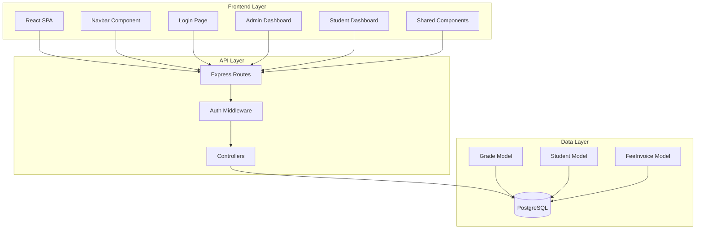
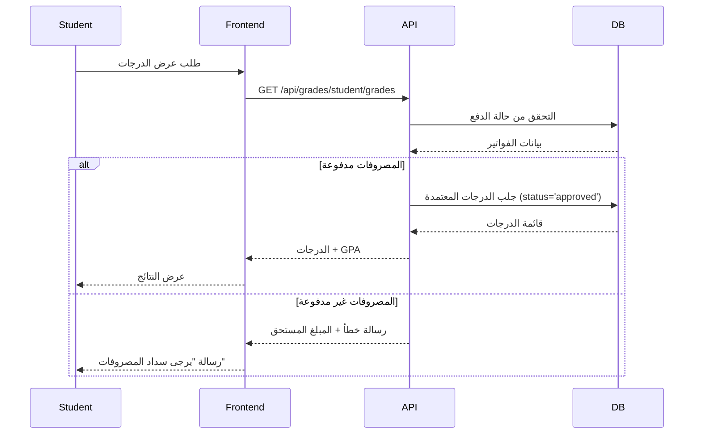
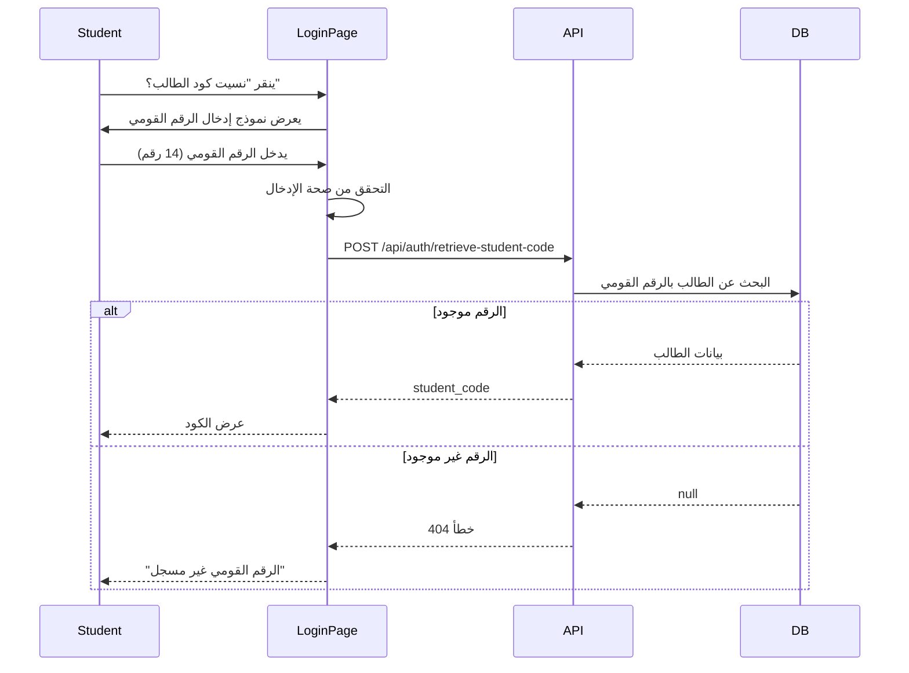

# مستند التصميم: تحسينات لوحات التحكم وواجهة المستخدم لنظام NCTU ERP

## نظرة عامة (Overview)

يهدف هذا التصميم إلى توحيد تجربة المستخدم البصرية عبر نظام NCTU ERP من خلال تطبيق نظام ألوان موحد (Purple Theme)، إضافة ميزات جديدة لتحسين إمكانية الوصول للمعلومات، وضمان عرض البيانات الحساسة (مثل الدرجات) بشكل آمن ومشروط.

### الأهداف الرئيسية

1. **التوحيد البصري**: تطبيق نظام الألوان البنفسجي (Purple Theme) عبر جميع المكونات
2. **تحسين تجربة المستخدم**: إضافة ميزات جديدة لتسهيل الوصول للمعلومات
3. **الأمان والخصوصية**: ضمان عرض الدرجات المعتمدة والمنشورة فقط للطلاب
4. **الاتساق المعماري**: الحفاظ على البنية الحالية مع تحسينات تدريجية

### نطاق المشروع

- توحيد ألوان الجداول في جميع الصفحات
- توحيد ألوان صفحة تسجيل الدخول ولوحة الإدارة
- إضافة ميزة استرجاع كود الطالب
- إضافة صفحة بيانات الطالب في Navbar
- التحقق من مسارات بطاقات التخصصات
- إضافة بطاقة عرض النتائج في لوحة الإدارة
- **تحسين منطق عرض الدرجات للطلاب**

## المعمارية (Architecture)

### البنية العامة للنظام



### نمط المعمارية

النظام يتبع معمارية **Client-Server** مع فصل واضح بين:
- **Frontend**: React SPA مع CSS Modules للتنسيق
- **Backend**: Express.js REST API
- **Database**: PostgreSQL مع Sequelize ORM

### تدفق البيانات



## المكونات والواجهات (Components and Interfaces)

### 1. نظام الألوان الموحد (Color System)

#### CSS Variables المحدثة

```css
:root {
  /* Purple Color System - Primary Theme */
  --purple-primary: #b36eff;
  --purple-dark: #9448b5;
  --purple-light: #b388ff;
  --purple-deep: #7e39b6;
  --purple-very-dark: #110117;
  
  /* Gradients */
  --gradient-primary: linear-gradient(135deg, #7e39b6, #b36eff);
  --gradient-background: linear-gradient(135deg, #0a043c, #1c062e, #2c003e);
  
  /* Glass Effect */
  --glass-bg: rgba(17, 1, 23, 0.5);
  --glass-border: rgba(179, 110, 255, 0.3);
  --glass-shadow: 0 8px 32px rgba(179, 110, 255, 0.15);
}
```

#### تطبيق النظام

جميع المكونات التالية يجب أن تستخدم هذا النظام:
- الجداول (Tables)
- النماذج (Forms)
- البطاقات (Cards)
- الأزرار (Buttons)
- صفحة تسجيل الدخول
- لوحات التحكم

### 2. مكون الجدول الموحد (Unified Table Component)

#### الواجهة

```typescript
interface TableProps {
  columns: Column[];
  data: any[];
  loading?: boolean;
  onRowClick?: (row: any) => void;
  className?: string;
}

interface Column {
  key: string;
  header: string;
  render?: (value: any, row: any) => React.ReactNode;
  sortable?: boolean;
}
```

#### التنسيق

```css
.unified-table {
  background: var(--glass-bg);
  backdrop-filter: blur(25px);
  border-radius: 12px;
  border: 1px solid var(--glass-border);
  box-shadow: var(--glass-shadow);
  overflow: hidden;
}

.unified-table thead {
  background: var(--purple-primary);
  color: white;
}

.unified-table tbody tr:hover {
  background: rgba(179, 110, 255, 0.1);
  cursor: pointer;
}
```

### 3. صفحة تسجيل الدخول المحدثة (Updated Login Page)

#### المكونات الجديدة

##### أ. نموذج استرجاع كود الطالب

```typescript
interface ForgotCodeModalProps {
  isOpen: boolean;
  onClose: () => void;
}

interface ForgotCodeFormData {
  national_id: string;
}
```

##### ب. API Endpoint جديد

```
POST /api/auth/retrieve-student-code
Body: { national_id: string }
Response: { success: boolean, data: { student_code: string } }
```

#### تدفق العمل



### 4. صفحة بيانات الطالب (Student Data Page)

#### المكون الجديد

```typescript
interface StudentDataPageProps {}

interface StudentData {
  payment_status: 'paid' | 'unpaid' | 'partial';
  total_due: number;
  result_status: 'published' | 'not_published';
  grades_available: boolean;
  last_updated: Date;
}
```

#### API Endpoints المطلوبة

```
GET /api/student/data
Response: {
  success: boolean,
  data: {
    payment_status: string,
    total_invoiced: number,
    total_paid: number,
    total_due: number,
    result_status: string,
    grades_count: number,
    last_updated: string
  }
}
```

#### التصميم

```css
.student-data-page {
  background: var(--gradient-background);
  min-height: 100vh;
  padding: 2rem;
}

.data-card {
  background: var(--glass-bg);
  backdrop-filter: blur(25px);
  border: 1px solid var(--glass-border);
  border-radius: 16px;
  padding: 2rem;
  margin-bottom: 1.5rem;
}

.status-badge {
  display: inline-block;
  padding: 0.5rem 1rem;
  border-radius: 20px;
  font-weight: 600;
}

.status-badge.paid {
  background: rgba(16, 185, 129, 0.2);
  color: #10b981;
  border: 1px solid #10b981;
}

.status-badge.unpaid {
  background: rgba(239, 68, 68, 0.2);
  color: #ef4444;
  border: 1px solid #ef4444;
}
```

### 5. بطاقة عرض النتائج في لوحة الإدارة (Results Display Card)

#### المكون

```typescript
interface ResultsDisplayCardProps {
  pendingCount: number;
  onClick: () => void;
}
```

#### الموقع في AdminDashboard

سيتم إضافة البطاقة في قسم "الإدارة العامة" (managementCards array):

```javascript
const managementCards = [
  // ... existing cards
  {
    title: 'عرض النتائج',
    icon: '📊',
    description: 'نشر النتائج للطلاب حسب الفصل أو السنة',
    path: '/admin/results-display',
    badge: stats.pendingGrades
  }
];
```

### 6. Navbar المحدث

#### التعديلات المطلوبة

```typescript
// إضافة رابط "بياناتي" للطلاب فقط
{user?.role === 'student' && (
  <button 
    className="nav-menu-item" 
    onClick={() => handleNavigation('/student/my-data')}
  >
    <FontAwesomeIcon icon={faUser} />
    بياناتي
  </button>
)}
```

## نماذج البيانات (Data Models)

### 1. Grade Model (محدث)

```javascript
const Grade = sequelize.define('Grade', {
  // ... existing fields
  
  status: {
    type: DataTypes.ENUM('draft', 'pending_admin_approval', 'approved'),
    defaultValue: 'draft',
    comment: 'حالة الدرجة'
  },
  
  // ملاحظة: لا يوجد حقل is_published في النموذج الحالي
  // الدرجات المعتمدة (approved) تعتبر منشورة تلقائياً
  
  professor_submitted_by: {
    type: DataTypes.INTEGER,
    allowNull: false,
    comment: 'الأستاذ الذي أدخل الدرجات'
  },
  
  admin_approved_by: {
    type: DataTypes.INTEGER,
    allowNull: true,
    comment: 'الأدمن الذي اعتمد الدرجات'
  },
  
  approved_at: {
    type: DataTypes.DATE,
    allowNull: true,
    comment: 'تاريخ الاعتماد'
  }
});
```

### 2. Student Model

```javascript
const Student = sequelize.define('Student', {
  id: DataTypes.INTEGER,
  user_id: DataTypes.INTEGER,
  student_code: DataTypes.STRING,
  national_id: DataTypes.STRING(14),
  specialty_id: DataTypes.INTEGER,
  current_year: DataTypes.INTEGER,
  current_semester: DataTypes.INTEGER,
  // ... other fields
});
```

### 3. FeeInvoice Model

```javascript
const FeeInvoice = sequelize.define('FeeInvoice', {
  id: DataTypes.INTEGER,
  student_id: DataTypes.INTEGER,
  total_amount: DataTypes.DECIMAL(10, 2),
  paid_amount: DataTypes.DECIMAL(10, 2),
  status: DataTypes.ENUM('pending', 'paid', 'overdue'),
  due_date: DataTypes.DATE,
  // ... other fields
});
```

## منطق عرض الدرجات للطلاب (Grade Display Logic)

### الشروط الحالية

حالياً، يتم عرض الدرجات للطالب إذا:
1. ✅ المصروفات مدفوعة بالكامل (`total_due <= 0.01`)
2. ✅ الدرجة معتمدة من الأدمن (`status = 'approved'`)

### الشروط المطلوبة (حسب الملاحظة الإضافية)

يجب أن تكون الدرجات:
1. ✅ محفوظة من قبل الدكتور (`professor_submitted_by IS NOT NULL`)
2. ✅ معتمدة من قبل الأدمن (`status = 'approved'` AND `admin_approved_by IS NOT NULL`)
3. ⚠️ منشورة للطلاب (`is_published = true` - **غير موجود حالياً**)

### التحليل

**المشكلة**: النموذج الحالي لا يحتوي على حقل `is_published` أو ما يعادله.

**الحلول المقترحة**:

#### الخيار 1: إضافة حقل is_published (موصى به)

```javascript
// Migration
await queryInterface.addColumn('grades', 'is_published', {
  type: Sequelize.BOOLEAN,
  defaultValue: false,
  comment: 'هل تم نشر الدرجة للطالب'
});

// Model Update
is_published: {
  type: DataTypes.BOOLEAN,
  defaultValue: false,
  comment: 'هل تم نشر الدرجة للطالب'
},

published_at: {
  type: DataTypes.DATE,
  allowNull: true,
  comment: 'تاريخ النشر'
},

published_by: {
  type: DataTypes.INTEGER,
  allowNull: true,
  references: {
    model: 'users',
    key: 'id'
  },
  comment: 'الأدمن الذي نشر الدرجة'
}
```

#### الخيار 2: استخدام status='published' (يتطلب تعديل ENUM)

```javascript
status: {
  type: DataTypes.ENUM('draft', 'pending_admin_approval', 'approved', 'published'),
  defaultValue: 'draft'
}
```

#### الخيار 3: الاعتماد على approved_at (الحل الحالي)

اعتبار أي درجة معتمدة (`status='approved'` AND `approved_at IS NOT NULL`) منشورة تلقائياً.

### القرار التصميمي

**سنتبع الخيار 1** لأنه:
- يوفر تحكم دقيق في النشر
- يفصل بين الاعتماد والنشر
- يسمح بنشر دفعات من الدرجات
- يحافظ على سجل تاريخي

### الكود المحدث

```javascript
// في getStudentGradesConditional
const grades = await Grade.findAll({
  where: {
    student_id: student.id,
    status: 'approved',
    is_published: true,  // ✅ شرط جديد
    admin_approved_by: { [Op.ne]: null }  // ✅ التأكد من الاعتماد
  },
  include: [/* ... */],
  order: [/* ... */]
});
```

## معالجة الأخطاء (Error Handling)

### استراتيجية معالجة الأخطاء

```typescript
enum ErrorType {
  VALIDATION_ERROR = 'VALIDATION_ERROR',
  AUTHENTICATION_ERROR = 'AUTHENTICATION_ERROR',
  AUTHORIZATION_ERROR = 'AUTHORIZATION_ERROR',
  NOT_FOUND_ERROR = 'NOT_FOUND_ERROR',
  DATABASE_ERROR = 'DATABASE_ERROR',
  NETWORK_ERROR = 'NETWORK_ERROR'
}

interface ErrorResponse {
  success: false;
  error: {
    type: ErrorType;
    message: string;
    details?: any;
  };
}
```

### معالجة الأخطاء في Frontend

```javascript
const handleApiError = (error) => {
  if (error.response) {
    // Server responded with error
    const { status, data } = error.response;
    
    switch (status) {
      case 400:
        toast.error(data.message || 'بيانات غير صحيحة');
        break;
      case 401:
        toast.error('يرجى تسجيل الدخول');
        navigate('/login');
        break;
      case 403:
        toast.error('ليس لديك صلاحية للوصول');
        break;
      case 404:
        toast.error('البيانات غير موجودة');
        break;
      case 500:
        toast.error('خطأ في الخادم، يرجى المحاولة لاحقاً');
        break;
      default:
        toast.error('حدث خطأ غير متوقع');
    }
  } else if (error.request) {
    // Request made but no response
    toast.error('لا يوجد اتصال بالخادم');
  } else {
    // Something else happened
    toast.error('حدث خطأ غير متوقع');
  }
};
```

### معالجة الأخطاء في Backend

```javascript
// Middleware للأخطاء
const errorHandler = (err, req, res, next) => {
  console.error('Error:', err);
  
  // Sequelize validation errors
  if (err.name === 'SequelizeValidationError') {
    return res.status(400).json({
      success: false,
      error: {
        type: 'VALIDATION_ERROR',
        message: 'بيانات غير صحيحة',
        details: err.errors.map(e => ({
          field: e.path,
          message: e.message
        }))
      }
    });
  }
  
  // JWT errors
  if (err.name === 'JsonWebTokenError') {
    return res.status(401).json({
      success: false,
      error: {
        type: 'AUTHENTICATION_ERROR',
        message: 'رمز المصادقة غير صحيح'
      }
    });
  }
  
  // Default error
  res.status(500).json({
    success: false,
    error: {
      type: 'DATABASE_ERROR',
      message: 'حدث خطأ في الخادم'
    }
  });
};
```

## استراتيجية الاختبار (Testing Strategy)

### 1. Unit Tests

#### Frontend Components

```javascript
// Example: ForgotCodeModal.test.jsx
describe('ForgotCodeModal', () => {
  it('should validate national ID format', () => {
    // Test that only 14 digits are accepted
  });
  
  it('should call API with correct data', async () => {
    // Test API call
  });
  
  it('should display student code on success', async () => {
    // Test success state
  });
  
  it('should display error message on failure', async () => {
    // Test error state
  });
});
```

#### Backend Controllers

```javascript
// Example: authController.test.js
describe('retrieveStudentCode', () => {
  it('should return student code for valid national ID', async () => {
    // Test successful retrieval
  });
  
  it('should return 404 for non-existent national ID', async () => {
    // Test not found case
  });
  
  it('should validate national ID format', async () => {
    // Test validation
  });
});
```

### 2. Integration Tests

```javascript
describe('Student Grade Display Flow', () => {
  it('should show grades when payment is complete and grades are published', async () => {
    // Setup: Create student, invoice (paid), grades (approved + published)
    // Test: GET /api/grades/student/grades
    // Assert: Grades are returned
  });
  
  it('should hide grades when payment is incomplete', async () => {
    // Setup: Create student, invoice (unpaid), grades (approved + published)
    // Test: GET /api/grades/student/grades
    // Assert: 403 error with payment message
  });
  
  it('should hide grades when not published', async () => {
    // Setup: Create student, invoice (paid), grades (approved but not published)
    // Test: GET /api/grades/student/grades
    // Assert: Empty grades array
  });
});
```

### 3. E2E Tests (Cypress)

```javascript
describe('Student Login and Grade View', () => {
  it('should allow student to retrieve forgotten code', () => {
    cy.visit('/login');
    cy.contains('نسيت كود الطالب؟').click();
    cy.get('input[name="national_id"]').type('12345678901234');
    cy.contains('استرجاع').click();
    cy.contains('NCTU-24-001').should('be.visible');
  });
  
  it('should show student data page in navbar', () => {
    cy.loginAsStudent();
    cy.get('.navbar').contains('بياناتي').should('be.visible');
  });
  
  it('should display grades when conditions are met', () => {
    cy.loginAsStudent();
    cy.visit('/student/my-data');
    cy.contains('حالة الدفع').should('be.visible');
    cy.contains('مدفوع').should('be.visible');
    cy.contains('النتائج').should('be.visible');
  });
});
```

### 4. Visual Regression Tests

```javascript
describe('Color Theme Consistency', () => {
  it('should match purple theme across all tables', () => {
    cy.visit('/admin/students');
    cy.matchImageSnapshot('admin-students-table');
    
    cy.visit('/professor/grades');
    cy.matchImageSnapshot('professor-grades-table');
    
    // Compare snapshots to ensure consistency
  });
});
```

### 5. Accessibility Tests

```javascript
describe('Accessibility', () => {
  it('should have no accessibility violations on login page', () => {
    cy.visit('/login');
    cy.injectAxe();
    cy.checkA11y();
  });
  
  it('should support keyboard navigation in navbar', () => {
    cy.visit('/');
    cy.get('body').tab();
    cy.focused().should('have.class', 'nav-menu-item');
  });
});
```

## الخلاصة

هذا التصميم يوفر:
1. ✅ نظام ألوان موحد عبر جميع المكونات
2. ✅ ميزات جديدة لتحسين تجربة المستخدم
3. ✅ منطق آمن لعرض الدرجات
4. ✅ معمارية قابلة للتوسع
5. ✅ استراتيجية اختبار شاملة

التصميم يحافظ على البنية الحالية مع إضافة تحسينات تدريجية، مما يقلل من المخاطر ويسهل التنفيذ.
