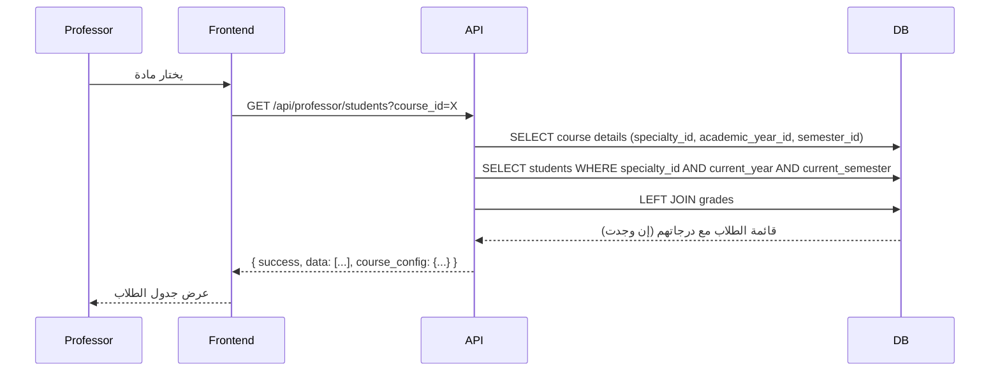

# تصميم إصلاح ربط المواد والطلاب بناءً على التخصص والسنة الدراسية والترم

## نظرة عامة

هذا المستند يصف التصميم التقني لإصلاح مشكلة عدم ظهور الطلاب في صفحة الأستاذ لإدارة الدرجات. المشكلة الأساسية هي أن النظام يعتمد على جدول `StudentEnrollment` لجلب الطلاب، بينما يجب أن يجلب جميع الطلاب بناءً على التخصص (`specialty_id`) والسنة الدراسية (`current_year`) والترم (`semester_id`) المرتبطة بالمادة.

بالإضافة إلى ذلك، صفحة إدارة المواد في admin dashboard لا تعرض أو تسمح بإدخال الترم، مما يمنع ربط المواد بالترمات بشكل صحيح.

### الأهداف الرئيسية

1. **إضافة دعم الترم**: إضافة حقل الترم في صفحة إدارة المواد وجميع الصفحات ذات الصلة
2. **تصحيح منطق جلب الطلاب**: تغيير المنطق من الاعتماد على `StudentEnrollment` إلى جلب الطلاب من جدول `Students` بناءً على التخصص والسنة الدراسية والترم
3. **تطبيق تصميم admin dashboard**: توحيد تصميم صفحة الأستاذ مع باقي النظام
4. **الحفاظ على وظائف Grade Settings**: التأكد من أن نظام الدرجات (assignment1, assignment2, final_exam) يعمل بشكل صحيح مع الإصلاح

## المصطلحات

- **semester_id**: معرف الترم (الفصل الدراسي) - يشير إلى سجل في جدول `semesters`
- **Semester**: جدول يحتوي على الترمات (Fall, Spring, Summer) مع ربطها بالسنة الأكاديمية
- **specialty_id**: معرف التخصص الدراسي
- **current_year**: السنة الدراسية الحالية للطالب (1, 2, 3, 4)
- **CourseGradeConfig**: إعدادات الدرجات لكل مادة (النسب والقيم القصوى)
- **Grade Settings**: الصفحة في admin dashboard لإدارة إعدادات الدرجات

## تفاصيل الخلل

### شرط الخلل (Bug Condition)

الخلل يظهر في عدة سيناريوهات:

1. **عدم ظهور الطلاب**: عندما يختار الأستاذ مادة، لا يظهر الطلاب المسجلون في نفس التخصص والسنة الدراسية والترم
2. **عدم وجود حقل الترم**: في صفحة `/admin/courses`، لا يوجد حقل لإدخال أو عرض الترم
3. **عدم وجود فلتر الترم**: في صفحة الأستاذ، لا يوجد dropdown لاختيار الترم

**المواصفات الرسمية:**
```
FUNCTION isBugCondition(course, student)
  INPUT: course من نوع Course, student من نوع Student
  OUTPUT: boolean
  
  RETURN student.specialty_id = course.specialty_id
         AND student.current_year = course.academic_year_id
         AND student EXISTS IN Students table
         AND student NOT IN (SELECT student_id FROM StudentEnrollment WHERE course_id = course.id)
END FUNCTION
```

## السلوك المتوقع

### متطلبات الحفاظ على السلوك الحالي

**السلوكيات غير المتغيرة:**
- حساب الدرجات بناءً على Grade Settings (assignment1, assignment2, final_exam)
- تحويل التقديرات (P/M/D) إلى درجات رقمية بناءً على config
- حساب المجموع النهائي والنسبة المئوية والتقدير
- وظائف إرسال الدرجات للمراجعة والاعتماد
- وظائف التصفية الموجودة (specialty, academic_year)

## Architecture

### نظرة عامة على البنية

```
Client (React + Vite)
  │
  ├── Pages
  │     ├── /admin/courses              → CourseManagement (تعديل)
  │     ├── /professor/grades           → ProfessorGrades (تعديل)
  │     └── /admin/grade-settings       → GradeSettings (موجود)
  │
  └── API Layer (axios)
        └── baseURL: /api

Server (Express.js)
  │
  ├── /api/admin/courses/*              → courseController (تعديل)
  ├── /api/professor/grades/*           → gradeController (تعديل)
  ├── /api/professor/students/*         → NEW endpoint
  └── /api/semesters/*                  → semesterController (موجود)
```

### تدفق البيانات - جلب الطلاب (الجديد)



## Components and Interfaces

### ملفات معدّلة - Backend

| الملف | التعديل |
|-------|---------|
| `server/controllers/gradeController.js` | إضافة `getStudentsByCourse` - جلب الطلاب بناءً على التخصص والسنة والترم |
| `server/routes/gradeRoutes.js` | إضافة مسار `GET /api/professor/students` |
| `server/controllers/courseController.js` | التأكد من حفظ `semester_id` عند إنشاء/تعديل المواد |

### ملفات معدّلة - Frontend

| الملف | التعديل |
|-------|---------|
| `client/frontend/src/pages/Admin/CourseManagement.jsx` | إضافة حقل الترم في النموذج والجدول |
| `client/frontend/src/pages/Professor/ProfessorGrades.jsx` | إضافة فلتر الترم + تطبيق تصميم admin dashboard |
| `client/frontend/src/pages/Professor/ProfessorGrades.module.css` | تطبيق ألوان admin dashboard |

## Data Models

### Course (موجود - التأكد من استخدام semester_id)

```javascript
// الحقول الموجودة بالفعل في Course model
{
  id: INTEGER,
  course_code: STRING,
  course_name: STRING,
  arabic_name: STRING,
  specialty_id: INTEGER,
  academic_year_id: INTEGER,
  semester_id: INTEGER,  // ← موجود بالفعل، نحتاج فقط لاستخدامه
  credit_hours: INTEGER,
  is_active: BOOLEAN
}
```

### Semester (موجود)

```javascript
{
  id: INTEGER,
  academic_year_id: INTEGER,
  semester_name: ENUM('Fall', 'Spring', 'Summer'),
  arabic_name: STRING,
  start_date: DATE,
  end_date: DATE,
  is_active: BOOLEAN
}
```

### Student (موجود - التأكد من استخدام current_semester)

```javascript
// نحتاج للتحقق من وجود current_semester في Student model
// إذا لم يكن موجوداً، نستخدم semester_id من Course فقط
{
  id: INTEGER,
  student_code: STRING,
  full_name: STRING,
  specialty_id: INTEGER,
  current_year: INTEGER,  // 1, 2, 3, 4
  // current_semester: INTEGER?  // قد نحتاج لإضافته
}
```

## API Design

### Professor Endpoints (جديد/تعديل)

#### 1. الحصول على طلاب المادة بناءً على التخصص والسنة والترم

```
GET /api/professor/students
Auth: professor
Query: course_id (required)

Logic:
1. جلب معلومات المادة (specialty_id, academic_year_id, semester_id)
2. جلب جميع الطلاب WHERE:
   - specialty_id = course.specialty_id
   - current_year = course.academic_year_id
3. LEFT JOIN مع جدول Grades لجلب الدرجات الموجودة
4. جلب CourseGradeConfig للمادة

Response: {
  success: true,
  data: [
    {
      student_id: 10,
      student_code: "2024001",
      full_name: "أحمد محمد",
      specialty_name: "Computer Science",
      current_year: 2,
      grade: {
        id: 50,
        assignment1_grade: "P",
        assignment2_grade: "M",
        assignment1_score: 30.00,
        assignment2_score: 21.00,
        final_exam_score: 120.00,
        total_score: 171.00,
        total_percentage: 81.43,
        final_result: "Merit",
        letter_grade: "B",
        grade_point: 3.0,
        status: "draft"
      } || null
    },
    ...
  ],
  course_info: {
    course_code: "CS201",
    course_name: "Data Structures",
    arabic_name: "هياكل البيانات",
    specialty_name: "Computer Science",
    academic_year: 2,
    semester_name: "Fall"
  },
  course_config: {
    ass1_max: 30.00,
    ass2_max: 30.00,
    final_max: 150.00,
    p_value: 30.00,
    m_value: 21.00,
    d_value: 15.00
  }
}
```

### Admin Endpoints (تعديل)

#### 2. إنشاء/تحديث مادة مع الترم

```
POST /api/admin/courses
PUT /api/admin/courses/:id
Auth: admin
Body: {
  course_code: "CS201",
  course_name: "Data Structures",
  arabic_name: "هياكل البيانات",
  specialty_id: 1,
  academic_year_id: 2,
  semester_id: 1,  // ← إضافة هذا الحقل
  credit_hours: 3,
  is_active: true
}

Validation:
- semester_id يجب أن يكون موجوداً في جدول semesters
- semester يجب أن يكون مرتبطاً بنفس academic_year_id

Response: {
  success: true,
  message: "تم إنشاء/تحديث المادة بنجاح",
  data: { ...course }
}
```

#### 3. الحصول على قائمة المواد مع الترم

```
GET /api/admin/courses
Auth: admin
Query: specialty_id?, academic_year_id?, semester_id?

Response: {
  success: true,
  data: [
    {
      id: 1,
      course_code: "CS201",
      course_name: "Data Structures",
      arabic_name: "هياكل البيانات",
      specialty_name: "Computer Science",
      academic_year: 2,
      semester_name: "Fall",  // ← إضافة هذا
      semester_arabic: "الفصل الدراسي الأول",  // ← إضافة هذا
      credit_hours: 3,
      is_active: true
    },
    ...
  ]
}
```

## Frontend Design

### صفحة إدارة المواد (Admin)

#### التعديلات المطلوبة

1. **إضافة حقل الترم في النموذج**:
```jsx
<FormControl>
  <FormLabel>الترم</FormLabel>
  <Select
    name="semester_id"
    value={formData.semester_id}
    onChange={handleChange}
    required
  >
    <option value="">اختر الترم</option>
    {semesters
      .filter(s => s.academic_year_id === formData.academic_year_id)
      .map(semester => (
        <option key={semester.id} value={semester.id}>
          {semester.arabic_name}
        </option>
      ))
    }
  </Select>
</FormControl>
```

2. **إضافة عمود الترم في الجدول**:
```jsx
<th>الترم</th>
...
<td>{course.semester_arabic}</td>
```

3. **إضافة فلتر الترم**:
```jsx
<Select
  value={filters.semester_id}
  onChange={(e) => setFilters({...filters, semester_id: e.target.value})}
>
  <option value="">جميع الترمات</option>
  {semesters.map(semester => (
    <option key={semester.id} value={semester.id}>
      {semester.arabic_name}
    </option>
  ))}
</Select>
```

### صفحة الأستاذ للدرجات

#### التعديلات المطلوبة

1. **إضافة فلتر الترم**:
```jsx
<div className={styles.filterSection}>
  <FormControl>
    <FormLabel>الترم</FormLabel>
    <Select
      value={selectedSemester}
      onChange={(e) => setSelectedSemester(e.target.value)}
    >
      <option value="">اختر الترم</option>
      {semesters.map(semester => (
        <option key={semester.id} value={semester.id}>
          {semester.arabic_name}
        </option>
      ))}
    </Select>
  </FormControl>
</div>
```

2. **تطبيق تصميم admin dashboard**:
```css
/* استخدام نفس الألوان من AdminDashboard.module.css */
.container {
  background: var(--color-bg, #f8fafc);
  min-height: 100vh;
  padding: 2rem;
}

.card {
  background: white;
  border-radius: 8px;
  box-shadow: 0 1px 3px rgba(0, 0, 0, 0.1);
  padding: 1.5rem;
}

.table {
  width: 100%;
  border-collapse: collapse;
}

.table th {
  background: #f1f5f9;
  padding: 0.75rem;
  text-align: right;
  font-weight: 600;
  color: #334155;
}

.table td {
  padding: 0.75rem;
  border-bottom: 1px solid #e2e8f0;
}
```

3. **تغيير API call لجلب الطلاب**:
```jsx
const fetchStudents = async (courseId) => {
  try {
    const response = await axios.get('/api/professor/students', {
      params: { course_id: courseId }
    });
    setStudents(response.data.data);
    setCourseConfig(response.data.course_config);
    setCourseInfo(response.data.course_info);
  } catch (error) {
    console.error('Error fetching students:', error);
  }
};
```

## Implementation Plan

### المرحلة 1: Backend - إضافة endpoint جديد

1. إنشاء دالة `getStudentsByCourse` في `gradeController.js`:
```javascript
exports.getStudentsByCourse = async (req, res) => {
  try {
    const { course_id } = req.query;
    const professorId = req.user.id;
    
    // 1. التحقق من أن الأستاذ مخصص لهذه المادة
    const professorCourse = await ProfessorCourse.findOne({
      where: { professor_id: professorId, course_id }
    });
    
    if (!professorCourse) {
      return res.status(403).json({
        success: false,
        message: 'غير مصرح لك بالوصول لهذه المادة'
      });
    }
    
    // 2. جلب معلومات المادة
    const course = await Course.findByPk(course_id, {
      include: [
        { model: Specialty, attributes: ['id', 'name', 'arabic_name'] },
        { model: Semester, attributes: ['id', 'semester_name', 'arabic_name'] }
      ]
    });
    
    // 3. جلب جميع الطلاب في نفس التخصص والسنة
    const students = await Student.findAll({
      where: {
        specialty_id: course.specialty_id,
        current_year: course.academic_year_id
      },
      include: [
        {
          model: Grade,
          where: { course_id },
          required: false  // LEFT JOIN
        }
      ]
    });
    
    // 4. جلب إعدادات المادة
    const config = await CourseGradeConfig.findOne({
      where: { course_id }
    });
    
    // 5. تنسيق البيانات
    const formattedStudents = students.map(student => ({
      student_id: student.id,
      student_code: student.student_code,
      full_name: student.full_name,
      specialty_name: course.Specialty.arabic_name,
      current_year: student.current_year,
      grade: student.Grade || null
    }));
    
    res.json({
      success: true,
      data: formattedStudents,
      course_info: {
        course_code: course.course_code,
        course_name: course.course_name,
        arabic_name: course.arabic_name,
        specialty_name: course.Specialty.arabic_name,
        academic_year: course.academic_year_id,
        semester_name: course.Semester.arabic_name
      },
      course_config: config || {
        ass1_max: 30.00,
        ass2_max: 30.00,
        final_max: 150.00,
        p_value: 30.00,
        m_value: 21.00,
        d_value: 15.00
      }
    });
  } catch (error) {
    console.error('Error fetching students:', error);
    res.status(500).json({
      success: false,
      message: 'حدث خطأ أثناء جلب الطلاب'
    });
  }
};
```

2. إضافة المسار في `gradeRoutes.js`:
```javascript
router.get('/professor/students', authMiddleware, roleMiddleware(['professor']), gradeController.getStudentsByCourse);
```

### المرحلة 2: Backend - تعديل Course endpoints

1. التأكد من حفظ `semester_id` في `courseController.js`:
```javascript
// في createCourse و updateCourse
const { course_code, course_name, arabic_name, specialty_id, academic_year_id, semester_id, credit_hours, is_active } = req.body;

// Validation
if (!semester_id) {
  return res.status(400).json({
    success: false,
    message: 'الترم مطلوب'
  });
}
```

2. تعديل `getAllCourses` لتضمين معلومات الترم:
```javascript
const courses = await Course.findAll({
  where: whereClause,
  include: [
    { model: Specialty, attributes: ['name', 'arabic_name'] },
    { model: Semester, attributes: ['semester_name', 'arabic_name'] }
  ]
});
```

### المرحلة 3: Frontend - تعديل صفحة Admin Courses

1. إضافة state للترمات:
```javascript
const [semesters, setSemesters] = useState([]);

useEffect(() => {
  fetchSemesters();
}, []);

const fetchSemesters = async () => {
  const response = await axios.get('/api/semesters');
  setSemesters(response.data.data);
};
```

2. إضافة حقل الترم في النموذج
3. إضافة عمود الترم في الجدول
4. إضافة فلتر الترم

### المرحلة 4: Frontend - تعديل صفحة Professor Grades

1. إضافة فلتر الترم
2. تغيير API call لاستخدام `/api/professor/students`
3. تطبيق تصميم admin dashboard (CSS)
4. تحديث منطق عرض الطلاب

### المرحلة 5: Testing

1. اختبار جلب الطلاب بناءً على التخصص والسنة والترم
2. اختبار إضافة/تعديل المواد مع الترم
3. اختبار الفلاتر في كلا الصفحتين
4. اختبار حساب الدرجات (التأكد من عدم تأثر Grade Settings)
5. اختبار التصميم على شاشات مختلفة

## Correctness Properties

### Property 1: جلب الطلاب الصحيحين

_لأي_ مادة موجودة في النظام، عند استدعاء `/api/professor/students?course_id=X`، يجب أن يُرجع النظام جميع الطلاب الذين:
- `specialty_id` = `course.specialty_id`
- `current_year` = `course.academic_year_id`

بغض النظر عن وجود سجل في `StudentEnrollment`.

### Property 2: الحفاظ على حساب الدرجات

_لأي_ درجة يتم حفظها، يجب أن يستمر النظام في:
- تحويل التقديرات (P/M/D) إلى درجات رقمية بناءً على `CourseGradeConfig`
- حساب `total_score` = `assignment1_score` + `assignment2_score` + `final_exam_score`
- حساب `total_percentage` بشكل صحيح
- تحديد `final_result` و `letter_grade` و `grade_point` بناءً على النسبة

### Property 3: ربط الترم بالمادة

_لأي_ مادة يتم إنشاؤها أو تعديلها، يجب أن:
- يكون `semester_id` مطلوباً
- يكون `semester_id` موجوداً في جدول `semesters`
- يكون الترم مرتبطاً بنفس `academic_year_id` للمادة

### Property 4: عرض الترم في جميع الصفحات

_لأي_ مادة يتم عرضها في:
- صفحة Admin Courses: يجب أن يظهر عمود الترم
- صفحة Professor Grades: يجب أن يظهر الترم في معلومات المادة
- Grade Settings: يجب أن يظهر الترم في قائمة المواد

## Testing Strategy

### اختبارات الوحدة (Unit Tests)

1. **Backend - getStudentsByCourse**:
   - اختبار جلب الطلاب بناءً على التخصص والسنة
   - اختبار عدم ظهور طلاب من تخصصات أخرى
   - اختبار عدم ظهور طلاب من سنوات أخرى
   - اختبار LEFT JOIN مع Grades (طلاب بدون درجات يظهرون)

2. **Backend - Course CRUD**:
   - اختبار حفظ semester_id عند إنشاء مادة
   - اختبار validation للترم
   - اختبار تعديل الترم

3. **Frontend - ProfessorGrades**:
   - اختبار فلتر الترم
   - اختبار عرض الطلاب
   - اختبار تطبيق التصميم

### اختبارات التكامل (Integration Tests)

1. **تدفق كامل - إضافة مادة مع ترم**:
   - إنشاء مادة جديدة مع semester_id
   - التحقق من ظهورها في Admin Courses مع الترم
   - التحقق من ظهورها في Professor Grades

2. **تدفق كامل - جلب الطلاب**:
   - إضافة طلاب في تخصص وسنة معينة
   - إضافة مادة لنفس التخصص والسنة والترم
   - التحقق من ظهور الطلاب في صفحة الأستاذ

3. **تدفق كامل - إضافة درجات**:
   - جلب الطلاب
   - إضافة درجات (P/M/D + final_exam_score)
   - التحقق من حساب الدرجات بشكل صحيح

## Migration Notes

إذا كانت قاعدة البيانات الحالية تحتوي على مواد بدون `semester_id`:

```sql
-- التحقق من المواد بدون semester_id
SELECT * FROM courses WHERE semester_id IS NULL;

-- تحديث المواد القديمة (مثال: تعيين الترم الأول كافتراضي)
UPDATE courses 
SET semester_id = (SELECT id FROM semesters WHERE semester_name = 'Fall' LIMIT 1)
WHERE semester_id IS NULL;
```
