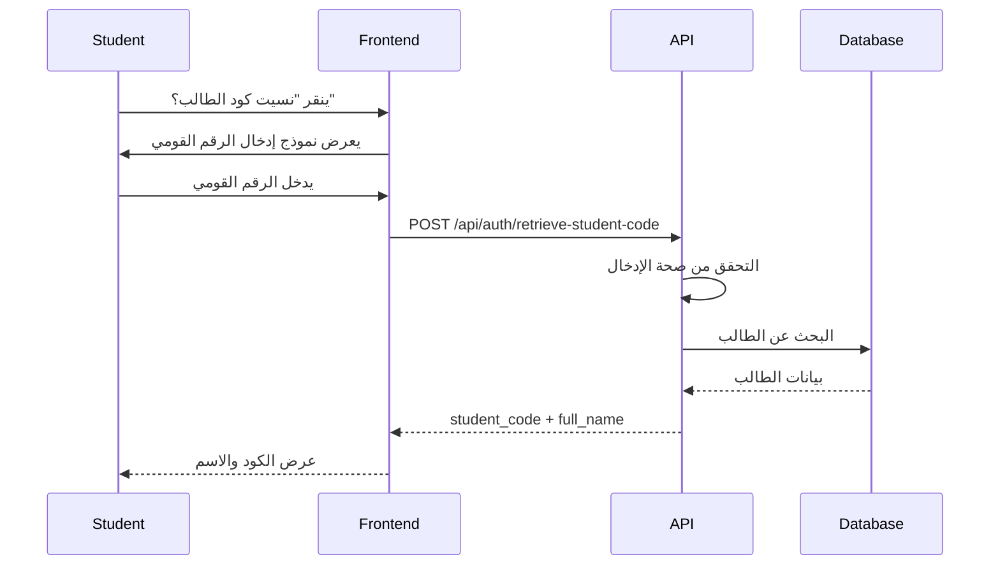
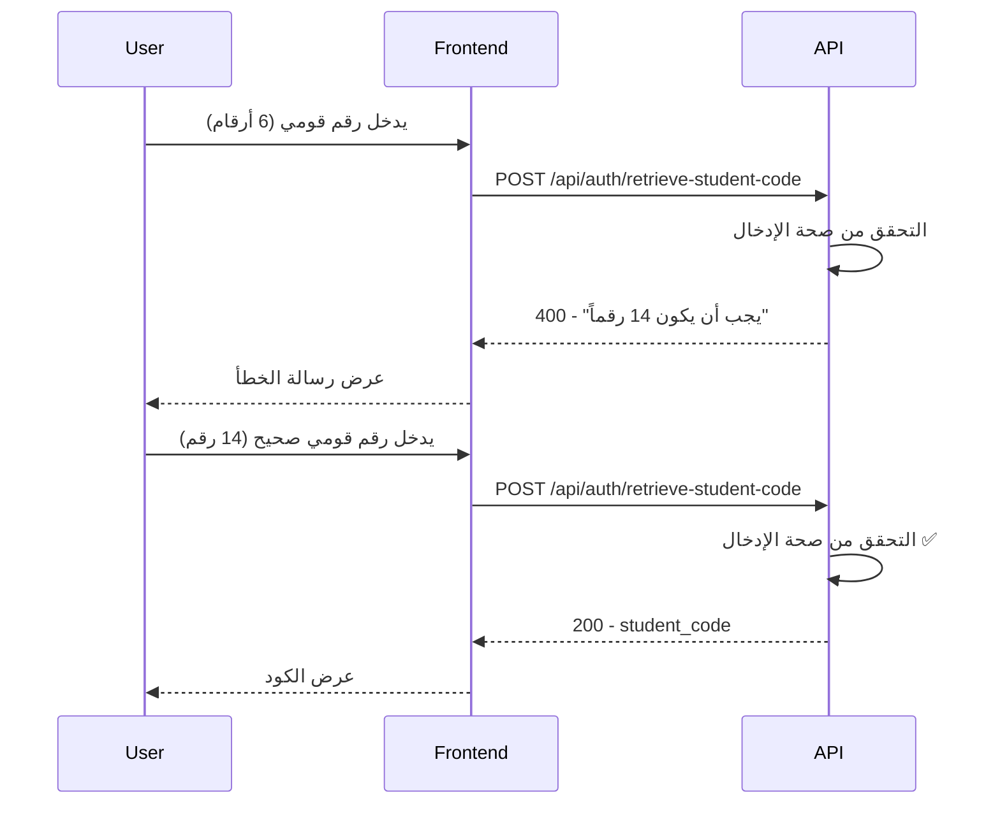

# توثيق API - استرجاع كود الطالب

## 📋 نظرة عامة

هذا التوثيق يغطي endpoint الجديد لاسترجاع كود الطالب باستخدام الرقم القومي.

---

## 🔗 Endpoint Details

### استرجاع كود الطالب

```http
POST /api/auth/retrieve-student-code
```

**الوصف**: يسمح للطلاب باسترجاع كود الطالب الخاص بهم باستخدام الرقم القومي.

**الوصول**: عام (Public) - لا يتطلب مصادقة

**Content-Type**: `application/json`

---

## 📥 Request

### Request Body

```json
{
  "national_id": "string (14 digits)"
}
```

### Parameters

| Parameter | Type | Required | Description | Validation |
|-----------|------|----------|-------------|------------|
| `national_id` | string | ✅ Yes | الرقم القومي المكون من 14 رقم | - يجب أن يكون 14 رقم بالضبط<br>- يجب أن يحتوي على أرقام فقط<br>- لا يقبل أحرف أو رموز |

### Request Example

```bash
curl -X POST http://localhost:5000/api/auth/retrieve-student-code \
  -H "Content-Type: application/json" \
  -d '{
    "national_id": "12345678901234"
  }'
```

---

## 📤 Response

### Success Response (200 OK)

```json
{
  "success": true,
  "message": "تم العثور على كود الطالب بنجاح",
  "data": {
    "student_code": "NCTU-24-001",
    "full_name": "أحمد محمد علي"
  }
}
```

### Response Fields

| Field | Type | Description |
|-------|------|-------------|
| `success` | boolean | حالة نجاح الطلب |
| `message` | string | رسالة توضيحية بالعربية |
| `data.student_code` | string | كود الطالب الفريد |
| `data.full_name` | string | الاسم الكامل للطالب |

---

## ❌ Error Responses

### 1. Missing National ID (400 Bad Request)

**الحالة**: عندما لا يتم إرسال الرقم القومي

```json
{
  "success": false,
  "message": "يرجى إدخال الرقم القومي"
}
```

**مثال Request**:
```bash
curl -X POST http://localhost:5000/api/auth/retrieve-student-code \
  -H "Content-Type: application/json" \
  -d '{}'
```

---

### 2. Invalid Format - Not 14 Digits (400 Bad Request)

**الحالة**: عندما يكون الرقم القومي أقل أو أكثر من 14 رقم

```json
{
  "success": false,
  "message": "الرقم القومي يجب أن يكون 14 رقماً بالضبط"
}
```

**أمثلة Requests**:

```bash
# أقل من 14 رقم
curl -X POST http://localhost:5000/api/auth/retrieve-student-code \
  -H "Content-Type: application/json" \
  -d '{
    "national_id": "123456"
  }'

# أكثر من 14 رقم
curl -X POST http://localhost:5000/api/auth/retrieve-student-code \
  -H "Content-Type: application/json" \
  -d '{
    "national_id": "123456789012345"
  }'
```

---

### 3. Invalid Format - Non-Numeric (400 Bad Request)

**الحالة**: عندما يحتوي الرقم القومي على أحرف أو رموز

```json
{
  "success": false,
  "message": "الرقم القومي يجب أن يكون 14 رقماً بالضبط"
}
```

**مثال Request**:
```bash
curl -X POST http://localhost:5000/api/auth/retrieve-student-code \
  -H "Content-Type: application/json" \
  -d '{
    "national_id": "1234567890ABCD"
  }'
```

---

### 4. National ID Not Found (404 Not Found)

**الحالة**: عندما لا يكون الرقم القومي مسجل في النظام

```json
{
  "success": false,
  "message": "الرقم القومي غير مسجل في النظام"
}
```

**مثال Request**:
```bash
curl -X POST http://localhost:5000/api/auth/retrieve-student-code \
  -H "Content-Type: application/json" \
  -d '{
    "national_id": "99999999999999"
  }'
```

---

### 5. Server Error (500 Internal Server Error)

**الحالة**: عند حدوث خطأ في الخادم

```json
{
  "success": false,
  "message": "حدث خطأ أثناء البحث عن كود الطالب"
}
```

---

## 🔒 Security Considerations

### 1. Rate Limiting

**التوصية**: تطبيق rate limiting لمنع الهجمات:

```javascript
const rateLimit = require('express-rate-limit');

const retrieveCodeLimiter = rateLimit({
  windowMs: 15 * 60 * 1000, // 15 دقيقة
  max: 5, // 5 محاولات كحد أقصى
  message: 'تم تجاوز عدد المحاولات المسموح بها، يرجى المحاولة بعد 15 دقيقة'
});

router.post('/retrieve-student-code', retrieveCodeLimiter, retrieveStudentCode);
```

### 2. Input Sanitization

**الحالي**: يتم التحقق من صحة الإدخال باستخدام regex:

```javascript
if (!/^\d{14}$/.test(national_id)) {
  return res.status(400).json({
    success: false,
    message: 'الرقم القومي يجب أن يكون 14 رقماً بالضبط'
  });
}
```

### 3. Logging

**التوصية**: تسجيل جميع محاولات الاسترجاع:

```javascript
console.log(`Retrieve attempt - National ID: ${national_id.substring(0, 4)}****`);
```

### 4. HTTPS Only

**التوصية**: استخدام HTTPS فقط في الإنتاج لحماية البيانات الحساسة.

---

## 📊 Use Cases

### Use Case 1: طالب نسي كود الطالب

**السيناريو**: طالب يريد تسجيل الدخول لكنه نسي كود الطالب الخاص به.

**الخطوات**:
1. الطالب ينقر على "نسيت كود الطالب؟" في صفحة تسجيل الدخول
2. يظهر نموذج لإدخال الرقم القومي
3. الطالب يدخل رقمه القومي (14 رقم)
4. النظام يتحقق من الرقم القومي
5. إذا كان موجوداً، يعرض كود الطالب والاسم الكامل
6. الطالب يستخدم الكود لتسجيل الدخول

**Flow Diagram**:


---

### Use Case 2: محاولة استرجاع برقم قومي غير صحيح

**السيناريو**: شخص يحاول استرجاع كود طالب برقم قومي غير صحيح.

**الخطوات**:
1. المستخدم يدخل رقم قومي غير صحيح (أقل من 14 رقم)
2. النظام يرفض الطلب ويعرض رسالة خطأ
3. المستخدم يصحح الإدخال ويحاول مرة أخرى

**Flow Diagram**:


---

## 🧪 Testing

### Unit Tests

```javascript
describe('retrieveStudentCode', () => {
  it('should return student code for valid national ID', async () => {
    const response = await request(app)
      .post('/api/auth/retrieve-student-code')
      .send({ national_id: '12345678901234' })
      .expect(200);
    
    expect(response.body.success).toBe(true);
    expect(response.body.data).toHaveProperty('student_code');
    expect(response.body.data).toHaveProperty('full_name');
  });
  
  it('should return 400 for missing national ID', async () => {
    const response = await request(app)
      .post('/api/auth/retrieve-student-code')
      .send({})
      .expect(400);
    
    expect(response.body.success).toBe(false);
    expect(response.body.message).toContain('يرجى إدخال');
  });
  
  it('should return 400 for invalid format', async () => {
    const response = await request(app)
      .post('/api/auth/retrieve-student-code')
      .send({ national_id: '123' })
      .expect(400);
    
    expect(response.body.success).toBe(false);
    expect(response.body.message).toContain('14 رقماً');
  });
  
  it('should return 404 for non-existent national ID', async () => {
    const response = await request(app)
      .post('/api/auth/retrieve-student-code')
      .send({ national_id: '99999999999999' })
      .expect(404);
    
    expect(response.body.success).toBe(false);
    expect(response.body.message).toContain('غير مسجل');
  });
});
```

### Integration Tests

```javascript
describe('Retrieve Student Code Integration', () => {
  beforeAll(async () => {
    // إنشاء طالب اختباري
    await Student.create({
      national_id: '12345678901234',
      student_code: 'NCTU-24-TEST',
      user_id: testUserId
    });
  });
  
  afterAll(async () => {
    // حذف بيانات الاختبار
    await Student.destroy({ where: { national_id: '12345678901234' } });
  });
  
  it('should retrieve student code successfully', async () => {
    const response = await request(app)
      .post('/api/auth/retrieve-student-code')
      .send({ national_id: '12345678901234' })
      .expect(200);
    
    expect(response.body.data.student_code).toBe('NCTU-24-TEST');
  });
});
```

---

## 📈 Performance

### Response Time Benchmarks

| Scenario | Expected Time | Acceptable Time |
|----------|---------------|-----------------|
| Valid National ID | < 100ms | < 200ms |
| Invalid Format | < 50ms | < 100ms |
| Not Found | < 150ms | < 300ms |

### Database Query Optimization

```javascript
// ✅ Optimized - استخدام index على national_id
const student = await Student.findOne({
  where: { national_id },
  attributes: ['student_code', 'national_id'],
  include: [{
    model: User,
    attributes: ['full_name']
  }]
});

// ❌ Not Optimized - جلب جميع الحقول
const student = await Student.findOne({
  where: { national_id },
  include: [{ model: User }]
});
```

**التوصية**: إضافة index على حقل `national_id`:

```sql
CREATE INDEX idx_students_national_id ON students(national_id);
```

---

## 🔄 Versioning

### Current Version: v1

```
POST /api/auth/retrieve-student-code
```

### Future Versions

**v2 (مقترح)**:
- إضافة دعم لاسترجاع الكود عبر البريد الإلكتروني
- إضافة OTP للتحقق الإضافي

```
POST /api/v2/auth/retrieve-student-code
Body: {
  "national_id": "string",
  "email": "string" (optional),
  "send_otp": boolean (optional)
}
```

---

## 📝 Changelog

### Version 1.0.0 (2026-04-17)

**Added**:
- ✨ Endpoint جديد لاسترجاع كود الطالب
- ✅ Validation للرقم القومي (14 رقم)
- ✅ رسائل خطأ بالعربية
- ✅ دعم البحث بالرقم القومي

**Security**:
- 🔒 Input sanitization
- 🔒 Error handling
- 🔒 Logging

---

## 🤝 Contributing

### إضافة ميزات جديدة

1. Fork المشروع
2. أنشئ branch جديد (`git checkout -b feature/new-feature`)
3. Commit التغييرات (`git commit -m 'Add new feature'`)
4. Push إلى Branch (`git push origin feature/new-feature`)
5. افتح Pull Request

### معايير الكود

- استخدم ESLint للتحقق من الكود
- اكتب unit tests لجميع الميزات الجديدة
- وثّق جميع التغييرات في CHANGELOG.md

---

## 📞 Support

### الإبلاغ عن مشاكل

إذا واجهت أي مشاكل، يرجى فتح issue على GitHub مع:
- وصف المشكلة
- خطوات إعادة إنتاج المشكلة
- النتيجة المتوقعة
- النتيجة الفعلية
- لقطات شاشة (إن أمكن)

### الاتصال

- **Email**: support@nctu.edu
- **GitHub**: [NCTU-ERP Repository]
- **Documentation**: [API Docs]

---

**تاريخ التحديث**: 2026-04-17  
**الإصدار**: 1.0.0  
**المطور**: Kiro AI Assistant
